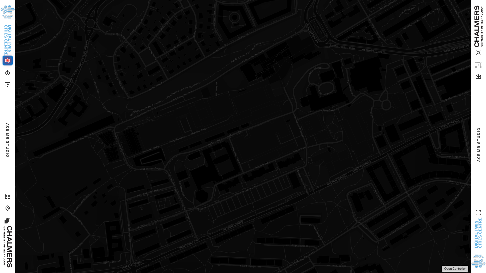
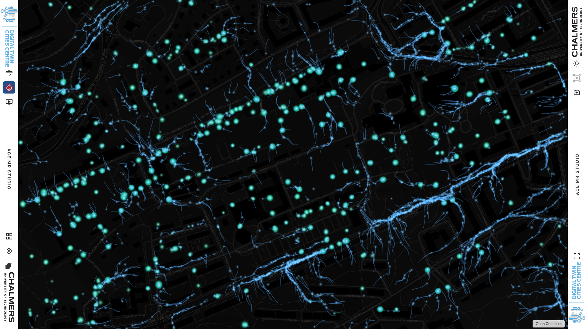
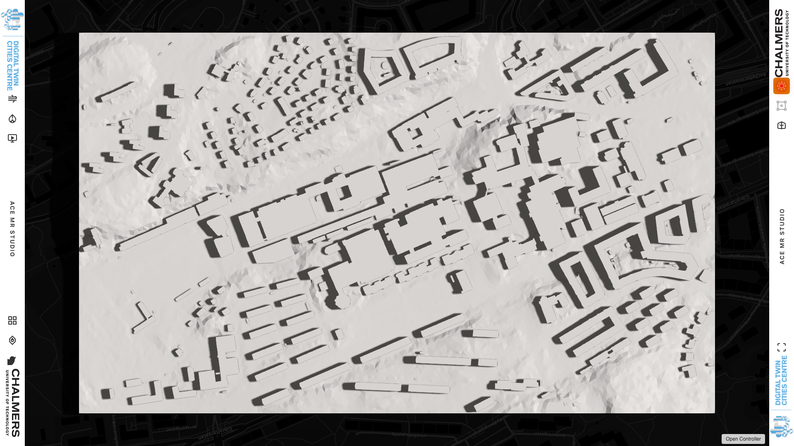
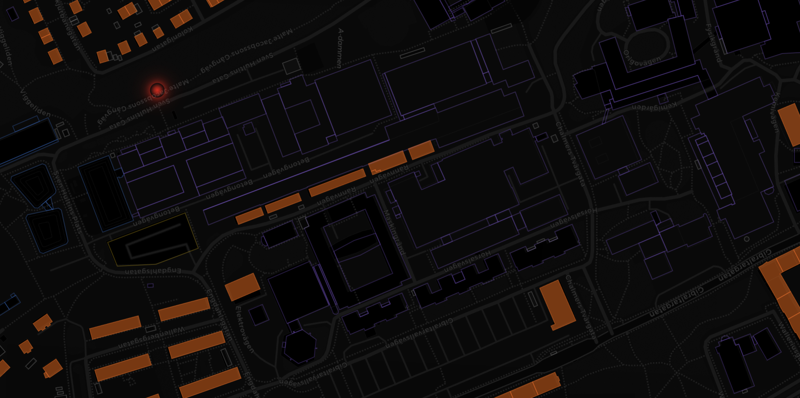
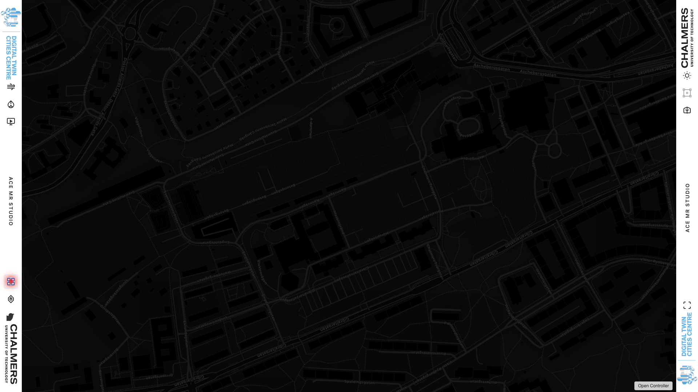
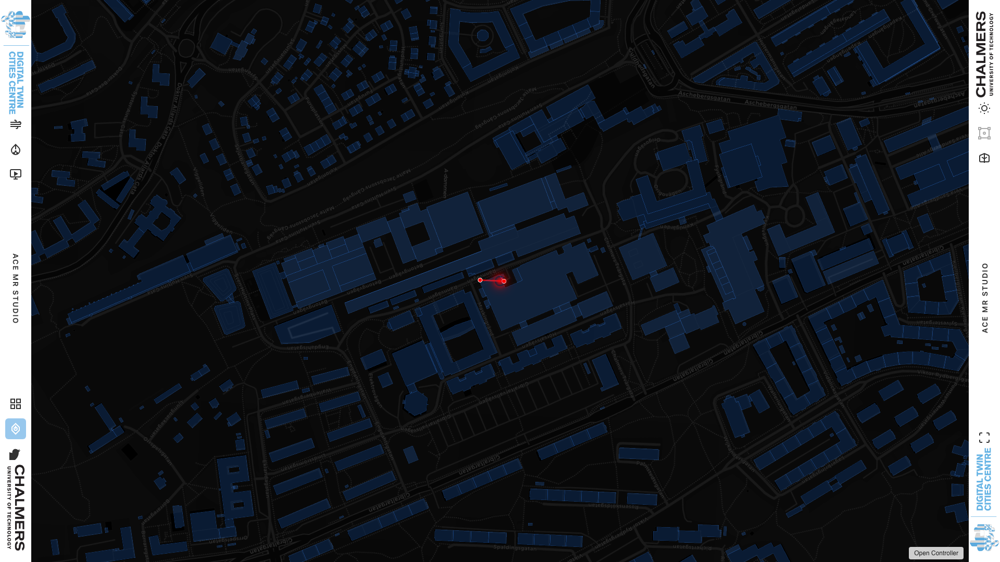
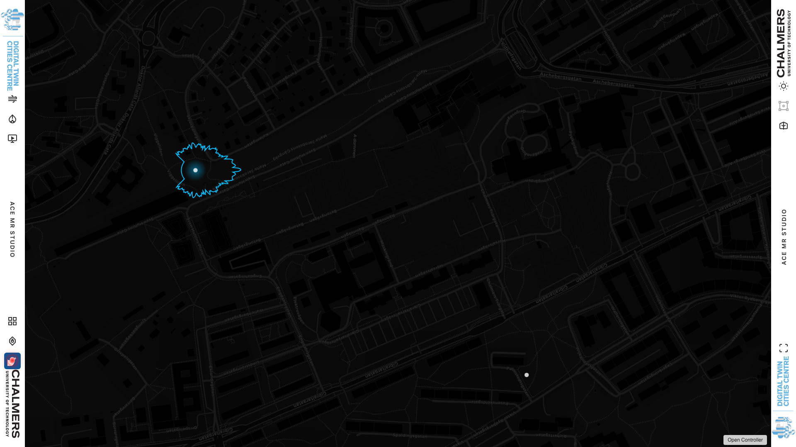
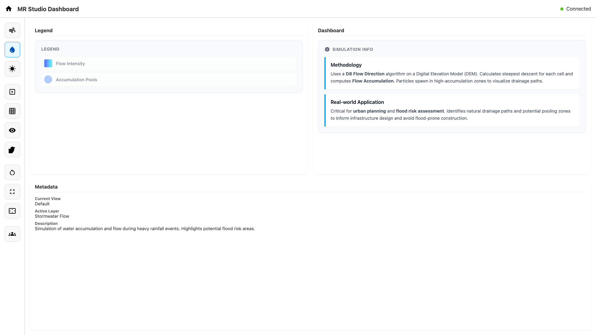
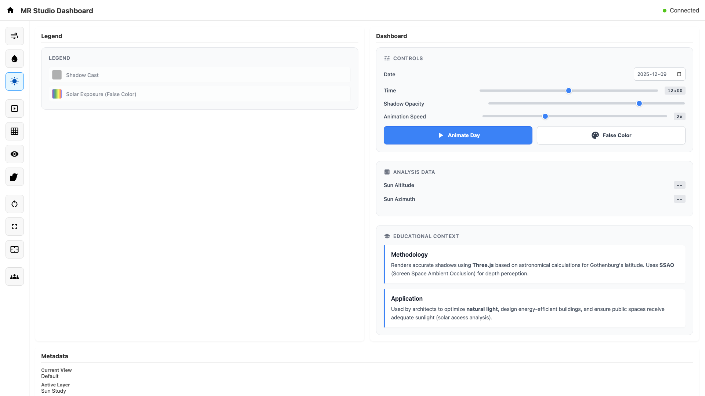
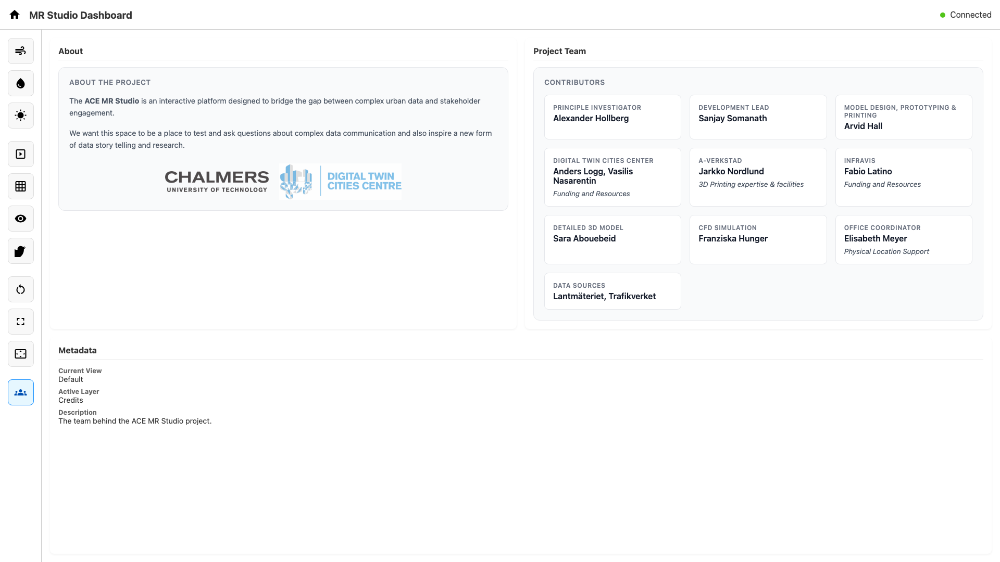

# ACE MR Studio - Interactive Map

An interactive mixed-reality urban visualization platform built for the ACE MR Studio at Chalmers University of Technology. This application provides multiple data visualization layers for urban planning, environmental analysis, and stakeholder engagement.


## Features

### 🗺️ Main Map View
The default view displays a dark basemap with the study area in Gothenburg, Sweden. Multiple basemaps are available including OpenStreetMap, Carto Positron/Dark, Esri Satellite, and OpenTopoMap.

### 🌬️ CFD Wind Simulation
Real-time Lattice Boltzmann CFD simulation showing wind flow patterns around buildings. The simulation computes fluid dynamics on the fly and visualizes velocity fields with color-coded flow lines.



### 💧 Stormwater Flow Analysis
Particle-based visualization of stormwater drainage using the D8 flow direction algorithm. Computes flow accumulation from a Digital Elevation Model (DEM) GeoTIFF and shows how water would flow across the terrain.



### ☀️ Sun Study
3D shadow analysis using Three.js. Loads an STL model of the buildings and computes solar shadow positions based on date, time, and the location's latitude/longitude (Gothenburg, Sweden).



### 🖼️ Slideshow
Animated slideshow of various data layers including building footprints, street networks, historic satellite imagery, and analysis results. Supports GeoJSON, images, and videos with metadata overlays.



### 📐 Grid Animation
Holographic grid overlay showing physical table tile boundaries. Used for calibrating the projection onto the physical model table.



### 👁️ Isovist Analysis
Interactive visibility/viewshed analysis. Click on the map to place a viewer and see the visible area based on building obstructions. Supports adjustable viewing distance and field of view.



### 🐦 Bird Sounds
Spatial audio visualization showing simulated bird sound sensors. Plays audio samples from various bird species with visual feedback on the map.



## Controller Interface

A secondary controller screen provides a touch-friendly interface for operating the visualizations remotely. It communicates with the main display via the BroadcastChannel API.

### Controller Main


### Stormwater Dashboard


### Sun Study Controls


### Credits


## How to Run

### Quick Start (Local Server)

```bash
# From the repository root
python3 -m http.server 8000
```

Then open:
- Main display: http://localhost:8000/index.html
- Controller: http://localhost:8000/controller.html

### Files Structure

```
├── index.html           # Main display page
├── controller.html      # Remote controller interface
├── main.js              # Map initialization and core functionality
├── controller.js        # Controller logic
├── style.css            # Styling for both interfaces
├── map-calibration.json # Saved map position/zoom/bearing
├── animations/          # Feature modules
│   ├── bird-sounds.js
│   ├── cfd-simulation.js
│   ├── grid-animation.js
│   ├── isovist.js
│   ├── slideshow.js
│   ├── stormwater-flow.js
│   ├── street-glow-animation.js
│   └── sun-study.js
├── media/               # Data files and assets
│   ├── building-footprints.geojson
│   ├── street-network.geojson
│   ├── clipped_dem.geotiff.tif
│   ├── mesh.stl
│   └── slideshow/
└── scripts/             # Utility scripts
    ├── process_dem_flow.py
    └── take_screenshots.py
```

## Technologies

- **MapLibre GL JS** - Map rendering with native rotation/bearing support
- **Three.js** - 3D rendering for sun study shadows
- **GeoTIFF.js** - DEM raster processing in-browser
- **BroadcastChannel API** - Cross-window communication
- **Web Audio API** - Spatial audio for bird sounds

## Credits

- **Principal Investigator**: Alexander Hollberg
- **Development Lead**: Sanjay Somanath  
- **Model Design & Printing**: Arvid Hall
- **Organizations**: Digital Twin Cities Centre, Chalmers University of Technology

## License

This project is part of the ACE MR Studio research initiative at Chalmers University of Technology.

