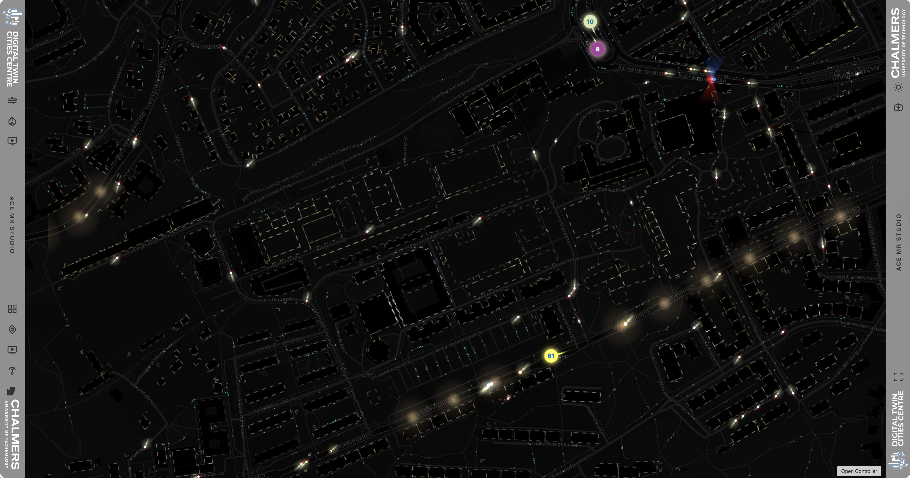
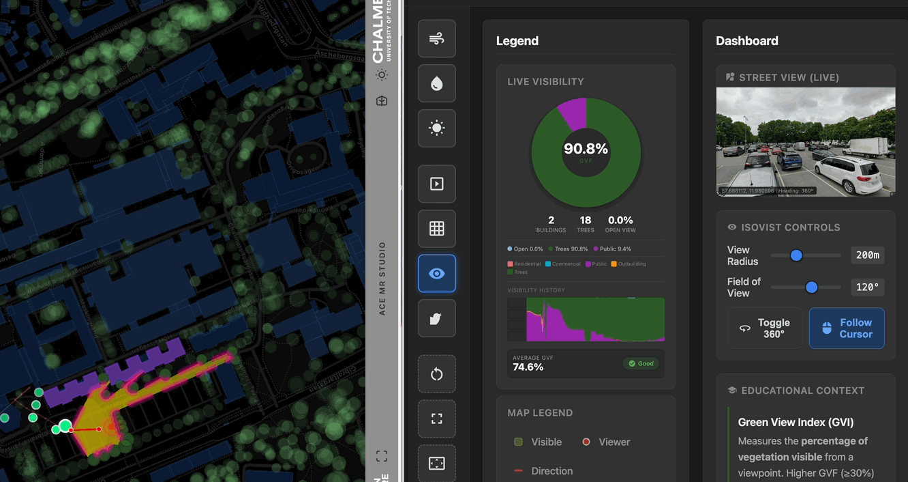

# ACE MR Studio – Interactive Map

An interactive mixed-reality urban visualisation platform built for the ACE MR Studio at Chalmers University of Technology. The application provides multiple data visualisation layers for urban planning, environmental analysis, and stakeholder engagement.


---

## Features

### 🗺️ Main Map View

The default view displays a dark basemap centred on the study area in Gothenburg, Sweden. Several basemap options are available, including OpenStreetMap, Carto Positron/Dark, Esri Satellite, and OpenTopoMap.

### 🚀 Launcher

A lightweight entry point that centralises app startup, lets you choose between the main display or the controller, performs initial asset loading checks, and helps recover from local file or CORS issues. Open the launcher using [launcher.html](launcher.html).


---

## Visualisation Layers

### 🌆 Street Life

An animated urban scene showing pedestrians, cars, buses, bicycles, and taxis moving along the street network. The visualisation includes warm-toned streetlights, glowing building outlines, and occasional emergency vehicles with flashing lights. It creates a lively data-driven representation of city activity and runs as the default background layer.



### 🚍 Public Transport (Västtrafik)

Real-time public transport overlay using the Västtrafik API. Displays live positions of buses, trams, trains, and ferries with smooth interpolated movement and trailing paths. Vehicle types are colour-coded and can be filtered by transport mode.

### 🌬️ CFD Wind Simulation

Real-time Lattice Boltzmann computational fluid dynamics simulation showing wind flow patterns around buildings. The simulation computes fluid dynamics on the fly and visualises velocity fields with colour-coded flow lines. Wind audio plays whilst the simulation is active.


**Additional capabilities:**

- Trees can be loaded as porous obstacles to simulate wind attenuation by vegetation.

### 💧 Stormwater Flow

Particle-based visualisation of stormwater drainage using the D8 flow direction algorithm. Flow direction and accumulation are computed dynamically from a Digital Elevation Model (DEM) GeoTIFF, showing how water would flow across the terrain. Glowing particles trace water paths, with pooling areas highlighted where water accumulates.


### ☀️ Sun Study

3D shadow analysis using Three.js. Loads STL models of buildings and computes solar shadow positions based on date, time, and location (Gothenburg, Sweden). Supports time-lapse animation through the day and includes SSAO post-processing for realistic ambient occlusion.


**Additional capabilities:**

- Trees can be added as separate STL models for shadow computation.
- A false-colour mode highlights shade contributions from vegetation.

### 🖼️ Slideshow

Media slideshow system supporting images, videos, GIFs, and GeoJSON layers with smooth transitions and metadata overlays. Useful for presenting building footprints, street networks, historic satellite imagery, and analysis results. Configuration is handled via a JSON file.


### 📐 Grid Animation

A sci-fi holographic grid overlay showing physical table tile boundaries. Used for calibrating the projection onto the physical model table. Features pulsing cyan glow effects and animated corner nodes.


### 👁️ Isovist Analysis

Interactive visibility and viewshed analysis. Click on the map to place a viewer and see the visible area based on building obstructions. The viewer can follow the cursor with smooth interpolation.




**Additional capabilities:**

- Trees can be loaded to include vegetation occlusion in the viewshed.
- Visible features (buildings, trees, points of interest) are highlighted.
- A dashboard shows the real-time Green View Index (GVI) and path history.
- Ambient soundscape responds to GVI: high greenery triggers bird sounds, whilst urban areas play city ambience.
- Google Street View can update in real time to match the viewer's location and heading.

### 🛤️ Street View Integration

Click anywhere on the map to fetch the corresponding Google Street View image. Includes SAM (Segment Anything Model) integration for automatic image segmentation when the local SAM server is running. The actual Street View camera position is fetched via metadata and displayed on the map.

### ✨ Street Glow Animation

Animated glowing paths along the street network. Streets are colour-coded by type (motorway, primary, residential, cycleway, etc.) with pulsing flow particles travelling along them.

### 🐦 Bird Sounds

Spatial audio visualisation with simulated bird sound sensors placed around the map. Plays audio samples from local bird species (Thrush Nightingale, European Pied Flycatcher, Black Redstart) with visual feedback showing active sensors and playback status.


### 🎓 Campus Demo

A presentation mode that animates SVG layers of a campus masterplan in sequence. Navigate through phases using arrow keys to reveal project boundaries, primary and secondary routes, activity nodes, and green spaces.

### 🎬 FCC Demo

Synchronised VR flythrough with isovist visualisation. Plays a VR recording video whilst tracking the corresponding position along a recorded path, with real-time isovist computation and Street View updates.

---

## Controller Interface

A secondary controller screen provides a touch-friendly interface for operating the visualisations remotely. It communicates with the main display via the BroadcastChannel API.

| Controller Main | Stormwater Dashboard |
|-----------------|---------------------|
|  |  |

| Sun Study Controls | Credits |
|-------------------|---------|
|  |  |

---

## How to Run

### Launcher (recommended)

Open the app using the launcher: [launcher.html](launcher.html). You can double-click the file in Finder or open it directly in your browser.

> **Note:** In most cases the app runs directly from `launcher.html`. If you encounter local file or CORS issues when loading assets (GeoTIFF, STL, or fetch requests), start a simple local server as a fallback:

```bash
# From the repository root (fallback only)
python3 -m http.server 8000
# then open http://localhost:8000/launcher.html
```

> **TODO:** Camera-based calibration is currently disabled—see [calibration/README.md](calibration/README.md) for notes. Re-enable when fixed.

---

## Project Structure

```
├── launcher.html          # Launcher / recommended entry point
├── index.html             # Main display page (alternate entry)
├── controller.html        # Remote controller interface
├── main.js                # Map initialisation and core functionality
├── controller.js          # Controller logic
├── style.css              # Styling for both interfaces
├── map-calibration.json   # Saved map position/zoom/bearing
├── animations/            # Feature modules
│   ├── bird-sounds.js     # Bird sound sensor visualisation
│   ├── campus-demo.js     # Campus masterplan SVG slideshow
│   ├── cfd-simulation.js  # Lattice Boltzmann wind simulation
│   ├── fcc-demo.js        # VR flythrough with isovist sync
│   ├── grid-animation.js  # Holographic calibration grid
│   ├── isovist.js         # Viewshed and visibility analysis
│   ├── slideshow.js       # Media slideshow system
│   ├── stormwater-flow.js # DEM-based water flow particles
│   ├── street_view.js     # Google Street View + SAM integration
│   ├── street-glow-animation.js # Animated street network paths
│   ├── street-life.js     # Urban activity simulation
│   ├── sun-study.js       # 3D shadow analysis
│   └── trafik.js          # Västtrafik live transit overlay
├── media/                 # Data files and assets
│   ├── building-footprints.geojson
│   ├── street-network.geojson
│   ├── clipped_dem.geotiff.tif
│   ├── mesh.stl
│   └── slideshow/
└── scripts/               # Utility scripts
    ├── process_dem_flow.py
    └── take_screenshots.py
```

---

## Technologies

| Technology | Purpose |
|------------|---------|
| **MapLibre GL JS** | Map rendering with native rotation and bearing support |
| **Three.js** | 3D rendering for sun study shadows and post-processing |
| **GeoTIFF.js** | DEM raster processing in the browser |
| **BroadcastChannel API** | Cross-window communication between display and controller |
| **Web Audio API** | Spatial audio for bird sounds and ambient soundscapes |
| **Västtrafik API** | Real-time public transport positions |
| **Google Street View API** | Street-level imagery integration |

---

## Credits

| Role | Name |
|------|------|
| **Principal Investigator** | Alexander Hollberg |
| **Development Lead** | Sanjay Somanath |
| **Model Design & Printing** | Arvid Hall |

**Organisations:** Digital Twin Cities Centre, Chalmers University of Technology

---

## Licence

This project is part of the ACE MR Studio research initiative at Chalmers University of Technology.

