# ACE MR Studio – Interactive Map

An interactive mixed-reality urban visualisation platform built for the ACE MR Studio at Chalmers University of Technology. The application provides multiple data visualisation layers for urban planning, environmental analysis, and stakeholder engagement.

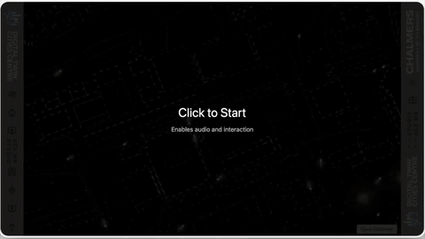
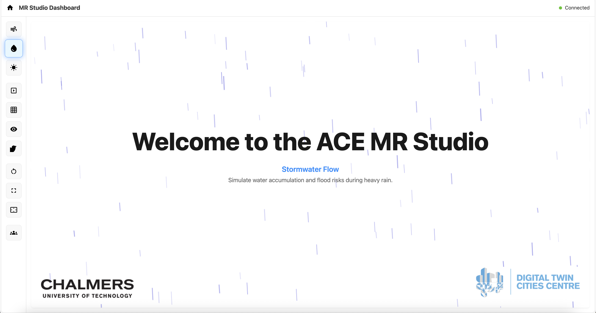

---

## Features

### 🗺️ Main Map View

The default view displays a dark basemap centred on the study area in Gothenburg, Sweden. Several basemap options are available, including OpenStreetMap, Carto Positron/Dark, Esri Satellite, and OpenTopoMap.

### 🚀 Launcher

A lightweight entry point that centralises app startup, lets you choose between the main display or the controller, performs initial asset loading checks, and helps recover from local file or CORS issues. Open the launcher using [launcher.html](launcher.html).

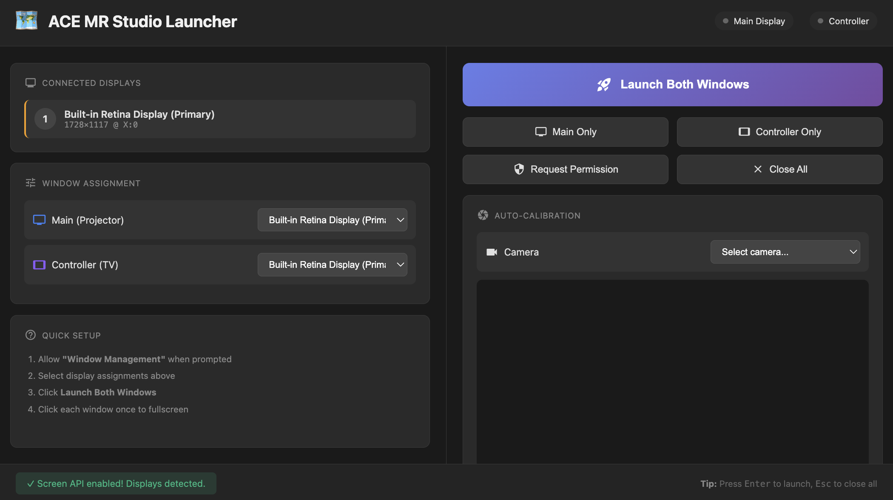

---

## Visualisation Layers

### 🌆 Street Life

An animated urban scene showing pedestrians, cars, buses, bicycles, and taxis moving along the street network. The visualisation includes warm-toned streetlights, glowing building outlines, and occasional emergency vehicles with flashing lights. It creates a lively data-driven representation of city activity and runs as the default background layer.

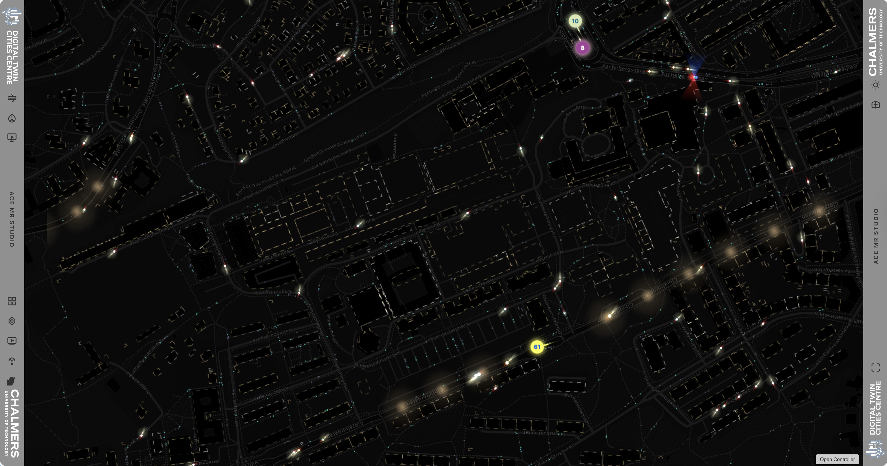

### 🚍 Public Transport (Västtrafik)

Real-time public transport overlay using the Västtrafik API. Displays live positions of buses, trams, trains, and ferries with smooth interpolated movement and trailing paths. Vehicle types are colour-coded and can be filtered by transport mode.

### 🌬️ CFD Wind Simulation

A qualitative **2D D2Q9/TRT** wind model around building footprints. Bright
ribbons or lightweight particles show motion over a faint speed heatmap. The controller’s **Wind appearance**
group provides shared palettes
(**Classic**, **Ocean**, **Ember**, **Monochrome**) that color both the marks and heatmap
in actual m/s, with selectable **0–5+, 0–10+, 0–20+, or 0–40+ m/s** legends. Wind audio plays while active.

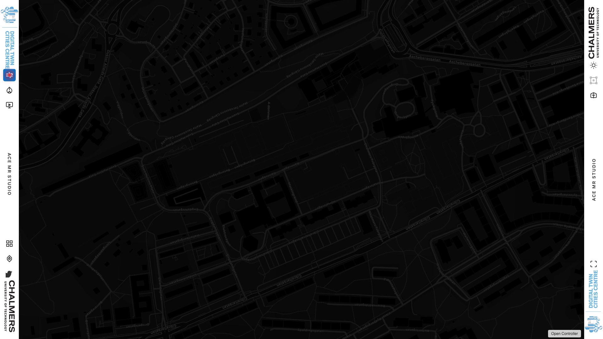

- Defaults: Ribbons, Classic, 0–20+ m/s, 5 m/s wind, Medium visual density,
  150 cells on the longer visible axis, and trees on.
  Flow direction is clockwise on the display: 0° right, 90° down.
- **Tracer playback** changes visualization speed only. Steady wind can settle
  to a steady color field; white highlights continue revealing its motion.
- **Ribbons** traces thin streamlines from stable seeds, refreshing paths at most
  five times per second while smoothly interpolating their displayed shape on
  every frame. Broad traveling highlights fade along continuous strokes.
- **Particles** uses fine, short fading tails and small white tips. Particles
  follow the computed field, including genuine reverse flow, and recycle at
  obstacles without connecting old and new trails. Stable brightness variation
  and a quieter heatmap keep the view light; no artificial gusts are added.
- **Wind-impact glow** lights the original building edges in both styles,
  including courtyard edges. Stronger approaching wind makes exposed faces
  brighter; sheltered and parallel faces stay dim. The indicator samples the
  incoming normal velocity just outside each edge and uses its square, with a
  fixed visual exposure and smooth transitions. It is a qualitative impact
  proxy, not surface pressure or [pressure coefficient Cp](https://www.grc.nasa.gov/www/winddocs/towne/plotc/plotc_p3d.html).
  Probes stop at intervening buildings. Warm halos turn neutral in Monochrome.
  Toggle it in Wind appearance; playback and the speed color range do not alter
  its strength. Geometry changes rebuild the edges and probe locations.
- **Visual density** adjusts ribbon seeds or the particle count. Color and density changes preserve
  the worker, solver progress, and physical settings. Color ranges change colors
  only. Selections survive stop/start in the page session.
- `cfd_control` supports `set_visual_style` (`ribbons`, `particles`),
  `set_color_palette` (`classic`, `ocean`, `ember`, `monochrome`),
  `set_color_range` (5, 10, 20, 40), and `set_facade_glow` (boolean). `cfd_state` returns `visualStyle`, `palette`,
  `colorMaxMps`, and `facadeGlow`. Existing density/playback messages remain compatible.
- Buildings use halfway bounce-back; all visible MultiPolygon parts and courtyards
  are preserved. The model includes complete footprints and canopies intersecting
  the table; off-table city blocks are excluded from the far-field buffers.
  Trees use approximate, resolution-scaled porous drag.
- The solver uses constant lattice viscosity (default 0.03, range 0.02–0.15),
  with a lattice inlet cap of 0.05 (0.025 for building masks, leaving headroom
  for corner acceleration). Displayed m/s are calibrated
  to the requested inlet speed, not to a validated atmospheric model.
- Velocity inlets and pressure outlets use
  [non-equilibrium extrapolation](https://doi.org/10.1088/1009-1963/11/4/310).
  Parallel far-field sides are open. An absorbing layer in the invisible padding
  suppresses reflected pressure waves; it never forces the visible flow. Invalid populations or excessive
  density/speed stop the calculation visibly; numerical values are not clipped.
- Obstacle cases start from rest with a smooth inlet ramp. Velocity snapshots are
  interpolated over 0.25 seconds for smooth tracer motion, preserving real reverse flow.
- A worker develops the flow independently of rendering. “Developing flow”
  remains until at least one visible-domain flow-through and five stable field
  comparisons; an unsteady solution may continue developing. Compatibility mode
  uses short main-thread batches at 100-cell resolution if workers cannot load.
- Geometry loads before simulation. Resize, calibration, and uploaded geometry
  rebuild the field. Controller panels request authoritative settings on opening.

This model illustrates wind **around footprints**, not over roofs. It does not
provide validated wind-comfort, pedestrian-safety, or engineering predictions.

Run the numerical, geometry, tracer, lifecycle, and supported-resolution checks:

```bash
node scripts/test_cfd_simulation.cjs
node scripts/test_cfd_visuals.cjs
# Extended campus stability and direction-reversal regression (8,000 steps per case):
node scripts/test_cfd_simulation.cjs --campus-long
```

The tests include analytical channel flow, mass conservation, rotated obstacle
wakes, wall exclusion, 30/60/120 FPS tracer parity, and stale asynchronous loads.

### 💧 Stormwater Flow

Particle-based visualisation of stormwater drainage using the D8 flow direction algorithm. Flow direction and accumulation are computed dynamically from a Digital Elevation Model (DEM) GeoTIFF, showing how water would flow across the terrain. Glowing particles trace water paths, with pooling areas highlighted where water accumulates.

The runoff layer uses `media/stormwater_dem.tif`, generated from the terrain and
building footprints. Buildings act as barriers and particles are excluded from
their footprints. The two-band file contains terrain with raised building cells
and an explicit building mask; the original terrain file is preserved. This ports
the building-barrier approach from `lindholmen` (`cf61923`, `7ab73a3`) to the current
campus data. Cells at or below 0 m are treated as water outlets, following that
branch's elevation fallback; this is a visualization, without roof drainage or a
sewer-network model.

After changing the terrain or footprints, regenerate the browser asset:

```sh
# Requires numpy and rasterio (or use the existing .venv/bin/python).
python scripts/process_dem_flow.py --browser-only
```

Omit `--browser-only` to also export `flow_direction.tif`, `flow_accumulation.tif`,
and `flow_data.json`. Defaults resolve relative to the repository, so the script
also works from another directory. Use `--dem`, `--buildings`, and `--output` to
process another dataset. Polygon and MultiPolygon footprints are reprojected to
the DEM grid, with courtyards preserved. Both Python and browser calculations use
strictly downhill D8 flow and count each upstream cell once. Rain particles spawn
uniformly across all valid ground cells, including narrow passages; accumulation
affects their downstream movement rather than biasing where rainfall starts.


### 🌡️ Outdoor Thermal Comfort

The CoolPaths layer serves processed PET rasters and street values for **15 July
2026**, 08:00–20:00 Stockholm time. Click once on the map for an origin, twice
for a destination, and a third time to start a new origin. The map shows both
shortest and coolest walking routes. The controller compares distance, mean
PET, cumulative heat exposure, and PET along each path. The cooler route can
be up to 50% longer than the shortest.

The local [`coolpaths/`](coolpaths/) pipeline follows the stages in
[CoolPaths](https://github.com/deepankverma/coolpaths): OpenStreetMap walking
paths and buildings, inferred building heights, Earth Engine canopy/NDVI/water/
terrain, shadows and sky view factor, NASA POWER weather, irradiance, MRT,
PET, and length-bounded routing. It uses a 2 m study grid and local
raster shadows instead of the notebook's Colab/Drive exports and pybdshadow
vectors. The map uses the published MEMI steady-state PET model and accounts
for a standing person's projected solar exposure when computing MRT. The
notebook's equal-PMV proxy remains available for comparison; it overstated
ordinary summer conditions in our cross-check. Source and method metadata
are included in the generated manifest.
The PET GeoTIFFs and PNGs carry product/source tags, while each hourly street
value file includes its date, hour, units, and sampling source.

The same CoolPaths dashboard includes a six-step **How CoolPaths works** tour.
Start playback or select any step to reveal buildings, canopy, vegetation,
water, terrain, reflectivity, shadows, sky view, radiation, PET, or walking
streets. The sun step advances through the prepared hours. The last step
uses your selected walk, or computes a real example on the prepared graph.
The projection's extent and camera never change during the tour.

Select **Inspect** and click the map to sample PET, radiant temperature, air
temperature, shade, sky view and canopy height in the dashboard. Inspection
preserves route selections; **Route** or **Back to routing** restores normal
three-click routing. The PET summary sits at the bottom of the map. The tour
uses cached local inputs and requires no new Earth Engine preparation.

The dashboard credits Deepank Verma, Olaf Mumm and Vanessa Miriam Carlow:
*CoolPaths: Street-scale Physiological Equivalent Temperature (PET) mapping
and cooler-routes planning using open data*. **City and Environment
Interactions, 30**, 100349 (2026).
[Publication](https://doi.org/10.1016/j.cacint.2026.100349).

### ☀️ Sun Study

3D shadow analysis using Three.js. Loads STL models of buildings and computes solar shadow positions based on date, time, and location (Gothenburg, Sweden). Supports time-lapse animation through the day and includes SSAO post-processing for realistic ambient occlusion.

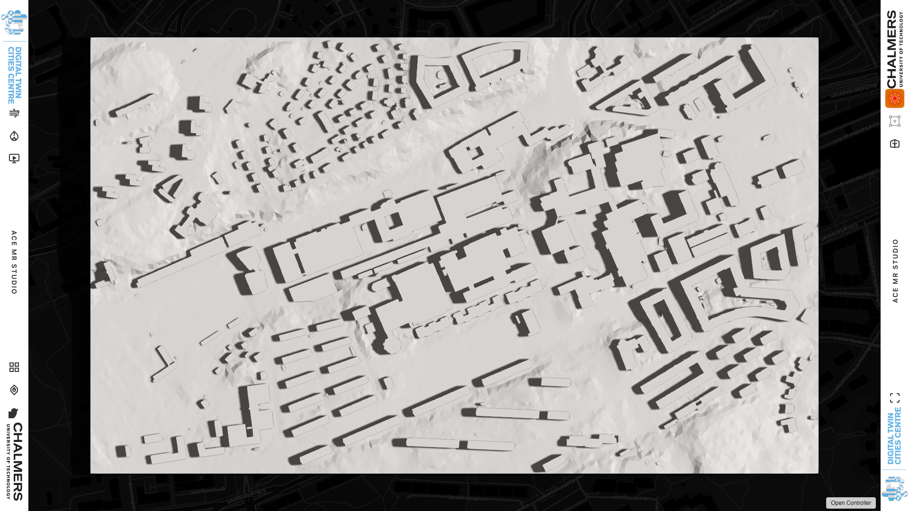

**Additional capabilities:**

- Trees can be added as separate STL models for shadow computation.
- A false-colour mode highlights shade contributions from vegetation.

### 🖼️ Slideshow

Media slideshow system supporting images, videos, GIFs, and GeoJSON layers with smooth transitions and metadata overlays. Useful for presenting building footprints, street networks, historic satellite imagery, and analysis results. Configuration is handled via a JSON file.

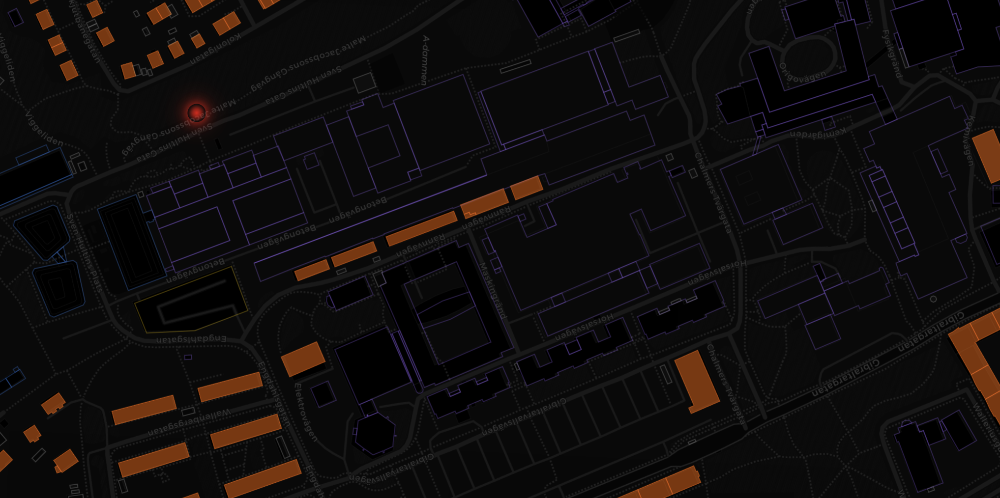

### 📐 Grid Animation

A sci-fi holographic grid overlay showing physical table tile boundaries. Used for calibrating the projection onto the physical model table. Features pulsing cyan glow effects and animated corner nodes.

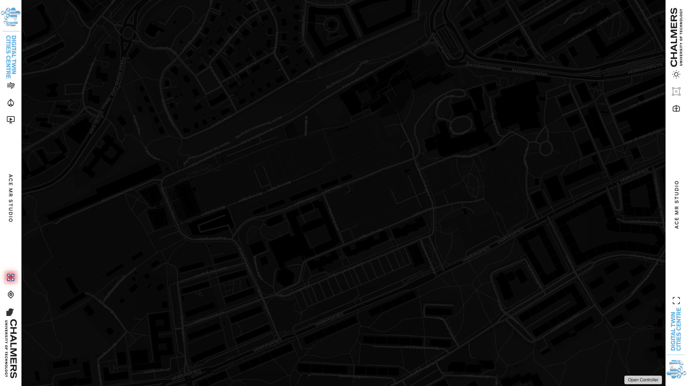

### 👁️ Isovist Analysis

Interactive visibility and viewshed analysis. Click on the map to place a viewer and see the visible area based on building obstructions. The viewer can follow the cursor with smooth interpolation.

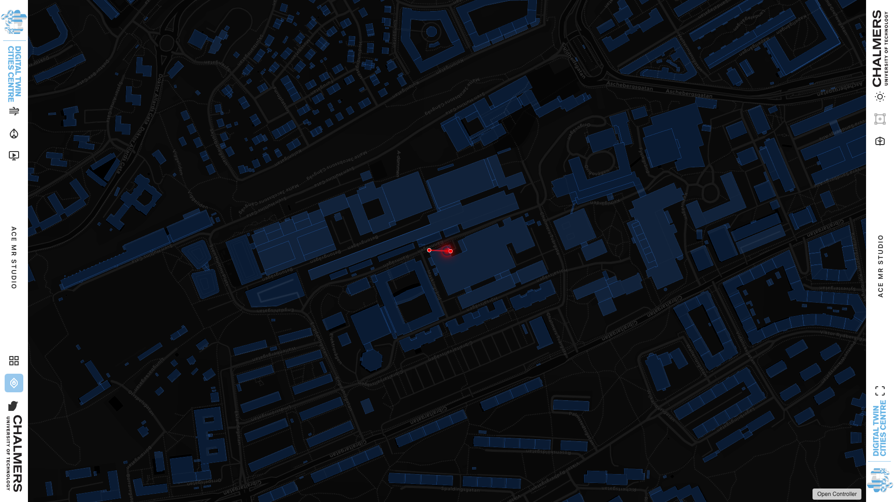
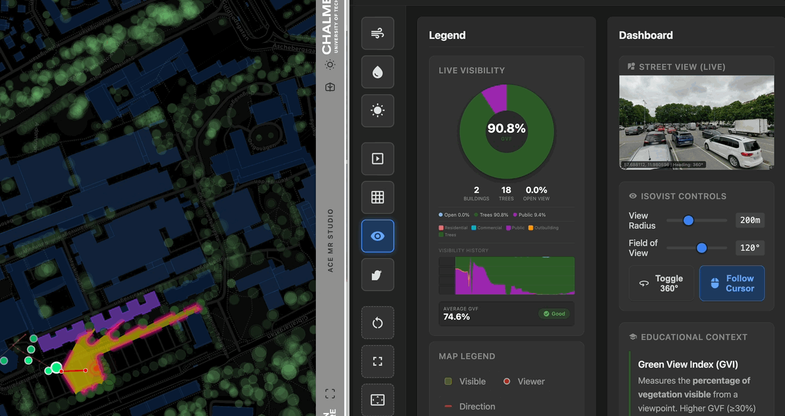

**Additional capabilities:**

- Trees can be loaded to include vegetation occlusion in the viewshed.
- Visible features (buildings, trees, points of interest) are highlighted.
- A dashboard shows the real-time Green View Index (GVI) and path history.
- Ambient soundscape responds to GVI: high greenery triggers bird sounds, whilst urban areas play city ambience.
- Google Street View can update in real time to match the viewer's location and heading.

### 🛤️ Street View Integration

Click anywhere on the map to fetch the corresponding Google Street View image. Includes SAM (Segment Anything Model) integration for automatic image segmentation when the local SAM server is running. The actual Street View camera position is fetched via metadata and displayed on the map.

### ✨ Street Glow Animation

Animated glowing paths along the street network. Streets are colour-coded by type (motorway, primary, residential, cycleway, etc.) with pulsing flow particles travelling along them.

### 🐦 Bird Sounds

Spatial audio visualisation with simulated bird sound sensors placed around the map. Plays audio samples from local bird species (Thrush Nightingale, European Pied Flycatcher, Black Redstart) with visual feedback showing active sensors and playback status.

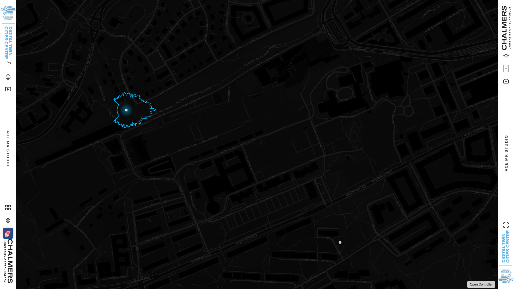

### 🎓 Campus Demo

A presentation mode that animates SVG layers of a campus masterplan in sequence. Navigate through phases using arrow keys to reveal project boundaries, primary and secondary routes, activity nodes, and green spaces.

### 🎬 FCC Demo

Synchronised VR flythrough with isovist visualisation. Plays a VR recording video whilst tracking the corresponding position along a recorded path, with real-time isovist computation and Street View updates.

---

## Controller Interface

A secondary controller screen provides a touch-friendly interface for operating the visualisations remotely. It communicates with the main display via the BroadcastChannel API.

| Controller Main | Stormwater Dashboard |
|-----------------|---------------------|
|  | 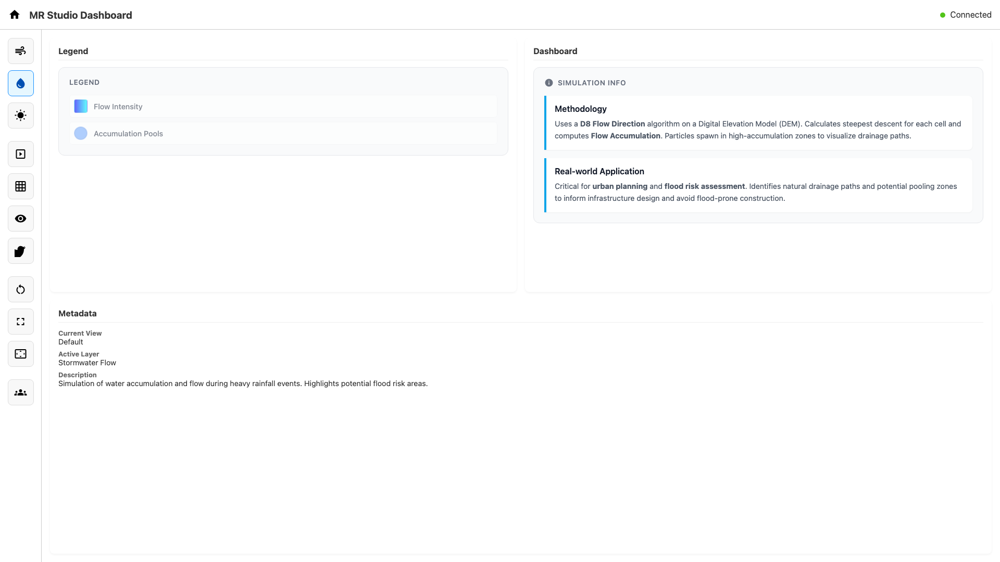 |

| Sun Study Controls | Credits |
|-------------------|---------|
| 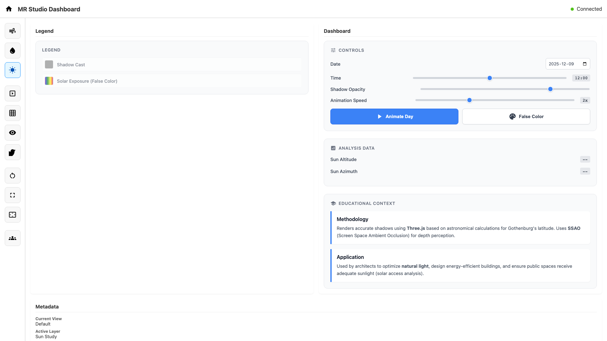 | 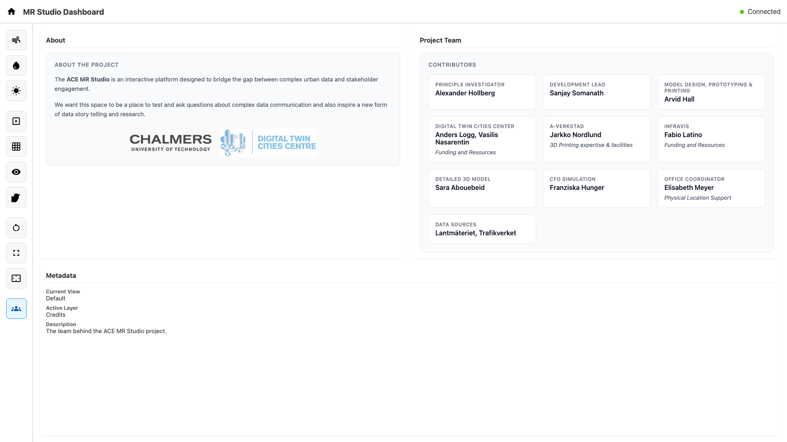 |

---

## How to Run

### Launcher (recommended)

Open the app using the launcher: [launcher.html](launcher.html). You can double-click the file in Finder or open it directly in your browser.

> **Note:** In most cases the app runs directly from `launcher.html`. If you encounter local file or CORS issues when loading assets (GeoTIFF, STL, or fetch requests), start a simple local server as a fallback:

```bash
# From the repository root (fallback only)
# Use python3 on macOS/Linux, or python on Windows:
python3 -m http.server 8090

# If python3 doesn't work, try:
python -m http.server 8090

# Then open http://localhost:8090/launcher.html
```

Manual calibration is available from the controller. Adjust the map, save named presets, or overwrite the default calibration there.

### ECOM energy layer

The map first shows the committed ECOM GeoJSON. Its live controls use the ECOM
backend in this repository. Place the campus demand CSVs in
`media/ecom/energy_data/` (kept out of Git), then start the API in a second
terminal:

```bash
./launch_ecom_backend.sh
```

The controller can run from Live Server on port 5500–5599 or the static server
on port 8090. Every ECOM connection follows `media/street-network.geojson`;
the API reports an error if it cannot find a street route.

### CoolPaths processing and live server

The Earth Engine Cloud project is `mlrenovation-479515` (MLRenovation). Grant
the service account `roles/serviceusage.serviceUsageConsumer` and
`roles/earthengine.viewer` on that project, save its JSON
key **outside this repository**, and set its absolute path locally. The public
NASA POWER and OSM requests do not need API keys. The generated study files
stay under ignored `coolpaths/data/`.

```bash
python3 -m venv coolpaths/.venv
coolpaths/.venv/bin/python -m pip install -r coolpaths/requirements.txt
export COOLPATHS_EE_KEY_FILE=/absolute/path/to/service-account.json
coolpaths/.venv/bin/python -m coolpaths.prepare
./launch_coolpaths_server.sh
```

Open the map through the launcher or a local static server. The CoolPaths API
runs at `http://127.0.0.1:8001`; its `/api/coolpaths/status` endpoint reports
whether the study is ready. Preparation downloads source data once and writes
all 13 hourly PET products before making the manifest available. Re-run with
`--force` after source changes. If the service account has not been configured
or preparation fails, the map reports that data is unavailable; it does not
display the old illustrative values.

The irradiance stage follows the CoolPaths notebook's pvlib Ineichen clear-sky
calculation. NASA POWER supplies daily aerosol, water vapor and ozone inputs,
plus hourly air temperature, humidity and wind. If a daily atmospheric value
is missing, preparation uses NASA POWER's July climatology for that field and
records the substitution in `manifest.json`. The current prepared study uses
July climatology for aerosol optical depth because POWER returned a missing
daily value for 15 July 2026. The 2 m shadow and sky-view calculations are
local raster adaptations of the notebook's geometry stages; building heights
outside the local footprint area may be inferred from OSM levels or a 6 m
default. PET is a modeled thermal comfort index, not the measured air
temperature. Clear-sky irradiance may overstate exposure during cloudy hours.

### EPC mode

The controller's EPC button colors the map's buildings by energy class and
shows a compact certificate summary when a building is clicked. The map uses
the generated [media/building-footprints-epc.geojson](media/building-footprints-epc.geojson)
artifact, so the EPC Browser does not need to run at presentation time.

Regenerate the artifact from the EPC Browser's read-only DuckDB database after
refreshing EPC data:

```bash
python3 scripts/export_epc_geojson.py \
    --database ../chalmers_epc_browser/epc_sweden.duckdb
```

The exporter matches the map's `objektidentitet` values against the EPC
Browser's enriched Gothenburg footprints and uses `FormularId` as the
certificate identifier. The current export contains 788 map footprints, 455
EPC-linked features, and 333 features without a match. The generated file
contains summary fields and selected detail fields only; the full EPC
database and any credentials must remain in the EPC Browser environment.

---

## Project Structure

```
├── launcher.html          # Launcher / recommended entry point
├── index.html             # Main display page (alternate entry)
├── controller.html        # Remote controller interface
├── main.js                # Map initialisation and core functionality
├── controller.js          # Controller logic
├── style.css              # Styling for both interfaces
├── map-calibration.json   # Saved map position/zoom/bearing
├── animations/            # Feature modules
│   ├── bird-sounds.js     # Bird sound sensor visualisation
│   ├── campus-demo.js     # Campus masterplan SVG slideshow
│   ├── cfd-core.js        # Testable Lattice Boltzmann solver and shared palettes
│   ├── cfd-worker.js      # Solver scheduling and field snapshots
│   ├── cfd-simulation.js  # Wind lifecycle, geometry, heatmap and controls
│   ├── cfd-visuals.js     # Ribbons and lightweight particles
│   ├── fcc-demo.js        # VR flythrough with isovist sync
│   ├── grid-animation.js  # Holographic calibration grid
│   ├── isovist.js         # Viewshed and visibility analysis
│   ├── slideshow.js       # Media slideshow system
│   ├── stormwater-flow.js # DEM-based water flow particles
│   ├── street_view.js     # Google Street View + SAM integration
│   ├── street-glow-animation.js # Animated street network paths
│   ├── street-life.js     # Urban activity simulation
│   ├── sun-study.js       # 3D shadow analysis
│   └── trafik.js          # Västtrafik live transit overlay
├── media/                 # Data files and assets
│   ├── building-footprints.geojson
│   ├── street-network.geojson
│   ├── clipped_dem.geotiff.tif
│   ├── mesh.stl
│   └── slideshow/
└── scripts/               # Utility scripts
    ├── process_dem_flow.py
    └── take_screenshots.py
```

---

## Technologies

| Technology | Purpose |
|------------|---------|
| **MapLibre GL JS** | Map rendering with native rotation and bearing support |
| **Three.js** | 3D rendering for sun study shadows and post-processing |
| **GeoTIFF.js** | DEM raster processing in the browser |
| **BroadcastChannel API** | Cross-window communication between display and controller |
| **Web Audio API** | Spatial audio for bird sounds and ambient soundscapes |
| **Västtrafik API** | Real-time public transport positions |
| **Google Street View API** | Street-level imagery integration |

---

## Credits

| Role | Name |
|------|------|
| **Principal Investigator** | Alexander Hollberg |
| **Development Lead** | Sanjay Somanath |
| **Model Design & Printing** | Arvid Hall |

**Organisations:** Digital Twin Cities Centre, Chalmers University of Technology

---

## Licence

This project is part of the ACE MR Studio research initiative at Chalmers University of Technology.
