# Universeum VizLab table: aesthetic and performance audit

25 September 2026 · Current `universeum` working tree, including existing uncommitted changes.

**Verdict: promising exhibit visuals, but not ready for museum sign-off.** Wind, stormwater, Sun Study playback/trees, both slides, the table grid, transit, Street View and Canvas produced visible output. Visibility, bird activation and controller state were not reliable enough in this run to pass. Short desktop timing samples do not certify projector frame rate.

## Method and scope

Inspected the running location package through the Codex in-app browser, saved and opened the screenshots below, exercised public controls, reviewed animation code, validated assets and ran relevant existing tests. No older README screenshots were used as evidence. Findings are observations unless explicitly marked as code findings or proposed acceptance criteria.

Actual tested viewport: **1280 × 720 CSS pixels, DPR 2**. The map backing canvas was 2560 × 1440; most animated overlays were 960 × 720. A requested 1920 × 1080 viewport override did not change the measured viewport, so that attempt is recorded as a repeat 720p test, not 1080p evidence. No 4K claim is made. Controller use, browser scheduling and other machine activity may affect these samples.

The new opt-in `index.html?audit=1` diagnostic reports requestAnimationFrame callback cadence, percentile intervals and long main-thread tasks. It does **not** measure completed GPU frames. It excludes hidden-tab time, uses a three-second warm-up after local controls, and bounds each window to 3,600 intervals. Static scenes can have excellent callback cadence while doing almost no rendering. Raw samples: [metrics.json](../media/screenshots/universeum/audit-2026-09-25/metrics.json).

## Highest-impact findings

1. **High — layer activation and controller state need repair before exhibition.** Isovist clicks did not produce a visible polygon; the Apps checkbox did not reliably retain its requested state. A later Isovist retry through the fresh controller still showed “Place viewer on map.” Bird activation did not produce clearly identifiable markers on the table, although the fresh controller later reported three active bird species. The controller sometimes showed Isovist or a loading slideshow while Sun Study was selected. A fresh controller recovered the Sun Study panel. These are failed interaction/clarity checks, not proof that the underlying data is missing. Inspect layer initialization and authoritative state synchronization. The `map.loaded()` / one-shot `load` pattern in Isovist and Birds is a code-level initialization risk; its causal role is unconfirmed.
2. **High — animation timing depends on refresh rate.** Code findings: `street-life.js:updateStreetLifeEntities` increments movement and stop timers per callback; `stormwater-flow.js:updateParticles` increments particle age, births and motion per callback; `sun-study.js:animate` uses a constant `0.016`; bird waves also advance per callback. Normalize against elapsed time, cap resume deltas, and verify the same simulated speed at 30/60/120 Hz. CFD already has frame-rate parity tests.
3. **High — the bird renderer can multiply animation loops.** Code finding: `move`, `moveend` and `zoom` all call `this.animate`, and that method schedules another RAF without a stored/cancelled frame ID. While active, navigation can create multiple recurring chains. Use one owned loop and separate invalidation from scheduling. This risk was not quantified because activation was unsuccessful in this run.
4. **High — reading hierarchy is too small at full extent.** The default QR occupies a roughly 15-pixel square at this viewport (5 cm over a 240 cm table height). The invitation, route numbers, Canvas toolbar and metadata are similarly tiny. A physically scaled control can still be unreadable at the available raster resolution. Keep geographic alignment, but establish a separately tested minimum size for visitor information and QR scanning. Use the controller for detailed settings.
5. **Medium — Sun Study decoration escapes the calibrated footprint.** Its compass overlaps the right rail and letterbox. `resizeOverlay` and compass placement still use `innerWidth - 120` and fixed pixel offsets rather than table bounds. Anchor it inside the map, scale it consistently and reduce competing midday labels. Keep geographic camera alignment unchanged.
6. **Medium — attractive layers need visitor explanations.** Wind ribbons and façade glow are appealing, but a visitor cannot read a prominent speed key or current settings on the table. Stormwater lacks a clear runoff/pooling key. Add a short layer title, one plain-language takeaway, units where appropriate and a compact legend, positioned for the table's viewing sides. Explicitly distinguish illustrative birds and qualitative environmental models from measurements.

## Timing results

| Scene | Sample | RAF cadence | p95 interval | p99 interval | Long tasks >50 ms |
| --- | ---: | ---: | ---: | ---: | ---: |
| Street Life + live transit | 25.2 s | 91.3 Hz | 18.1 ms | 25.5 ms | 1 (67 ms) |
| Wind | 24.1 s | 115.1 Hz | 10.3 ms | 17.6 ms | 0 |
| Stormwater | 29.1 s | 92.3 Hz | 16.9 ms | 18.0 ms | 0 |
| Sun Study, static | 19.1 s | 119.9 Hz | 9.7 ms | 10.2 ms | 0 |
| Building-footprint slideshow, static | 25.1 s | 120.0 Hz | 10.1 ms | 10.3 ms | 0 |
| Street Life + transit, repeat | 35.7 s | 77.1 Hz | 25.2 ms | 33.3 ms | 1 (80 ms) |
| Wind, repeat | 32.2 s | 114.8 Hz | 10.4 ms | 17.8 ms | 0 |
| Sun Study, playback enabled, trees off | 6.0 s | 120.0 Hz | 9.4 ms | 10.0 ms | 0 |
| Sun Study, playback enabled, trees on | 11.0 s | 120.0 Hz | 9.7 ms | 10.2 ms | 0 |

Wind has the strongest repeatable timing evidence here. Street Life/transit is more variable and its p95 misses a 16.7 ms budget; measure its canvas drawing cost and transit glow before increasing visual density. One intermediate screenshot showed approximately 42 Hz during mixed interaction, but that was not an isolated benchmark and does not establish a specific culprit. Sun Study playback was subsequently verified through a fresh controller, with advancing clock/sun position and a loaded tree model. Those short samples include changing daylight/night conditions; they are not a worst-case GPU or projector benchmark.

## Captured steps and layer health

### 1. Default Street Life and live transit — working, clarity/performance concerns

Dark geography gives the luminous vehicles a strong visual hierarchy. Live transit logs showed repeated position updates, around 138–147 vehicles during the run. Route labels compete at the centre, street labels rotate with the north-left map, and the invitation is extremely small. Simulated street activity and live transport need a clear visitor-facing distinction. An aborted token refresh was logged on switching layers; subsequent live updates continued.

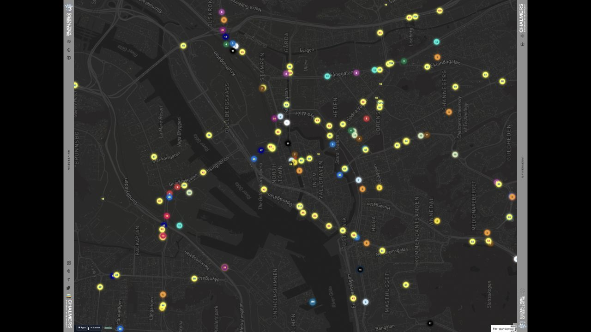

### 2. Wind — working, promising performance; interpretation needs improvement

Ribbons, obstacles and illuminated façades render, and the status progressed from developing to settled. Thin, low-contrast ribbons and a very small status label may disappear under ambient light. A clear palette key and wind direction/speed belong on the exhibit surface. Screenshot shows developing flow; the repeat sample's DOM reported settled flow.

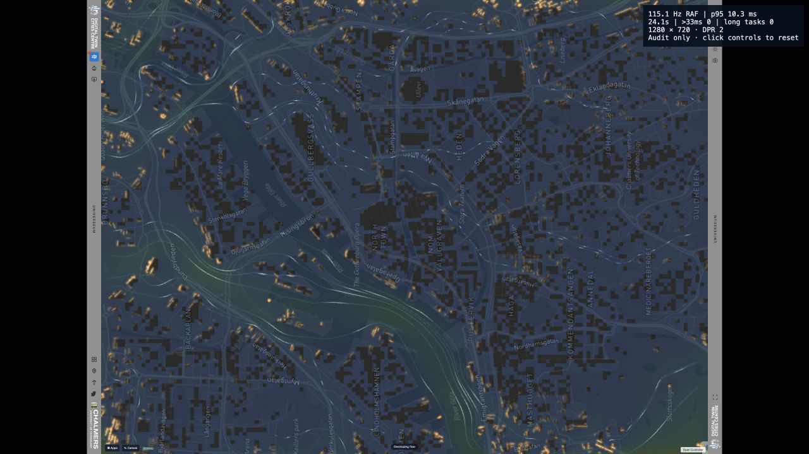

### 3. Stormwater — working; pooling distinction and timing need work

Runoff particles visibly follow the prepared terrain patterns. The composition is lively, but glowing points dominate without an obvious key separating flow from accumulation. Existing numerical tests pass; this remains exploratory terrain flow, not a calibrated drainage/flood prediction.

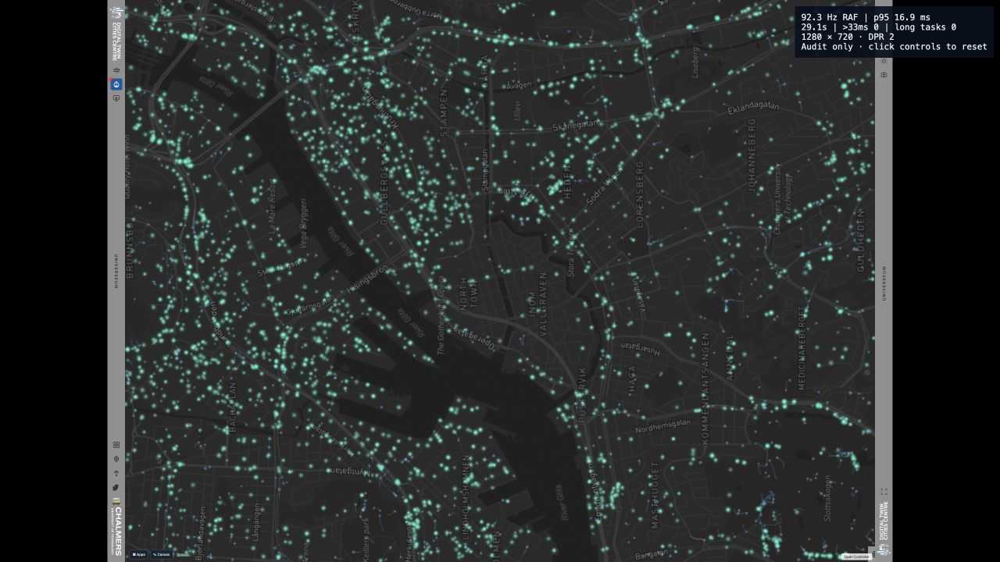

### 4. Sun Study — static render works; compass placement fails

The light terrain/building model is coherent and detailed. At noon the labels overlap, the compass extends outside the map onto the right rail and black margin, and much of the geometry has low tonal separation. The static renderer correctly gates work on dirty flags. Playback and trees worked after opening a fresh controller; at night the terrain becomes very hard to read. False-colour performance was not tested.

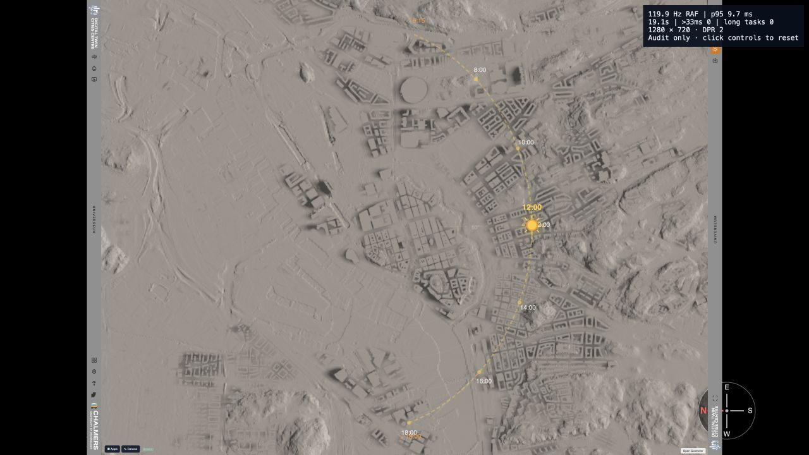

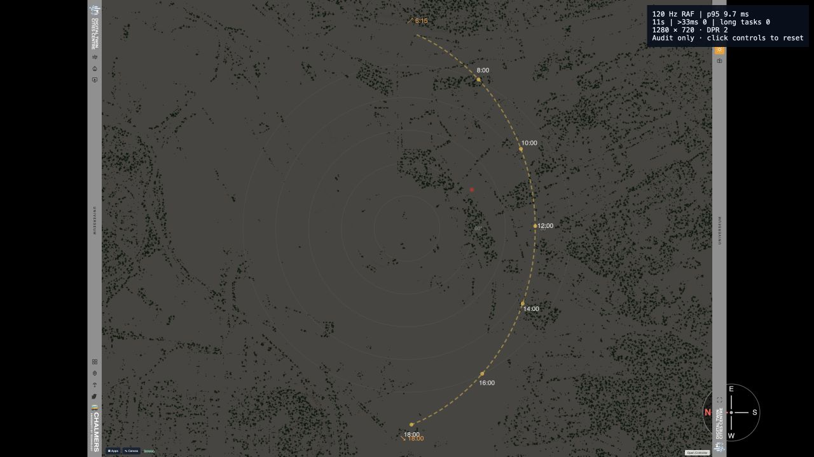

### 5. Visibility / Isovist — failed visible-result check

Tested rail activation, Apps activation and map placement/movement, including after leaving drawing mode. No convincing visibility polygon or observer appeared. The controller continued to ask for placement. Screenshot documents the failed state and does not validate Isovist. Prior project notes describe a similar symptom, but this verdict is based on this run.

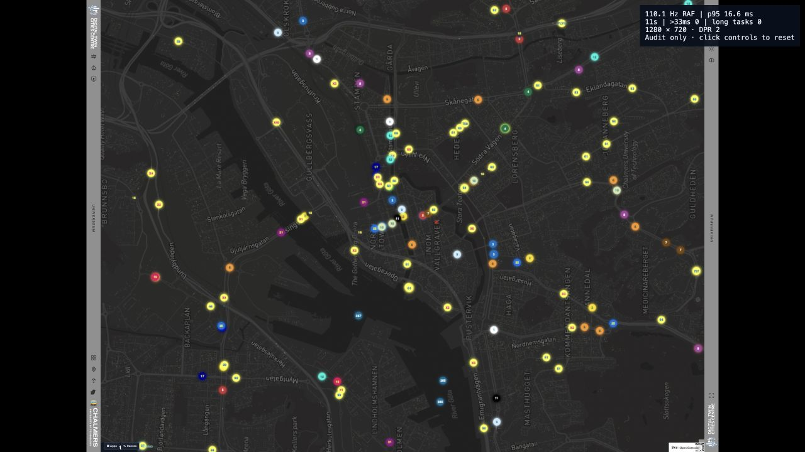

### 6. Bird sounds — controller activity verified on retry; projected markers unclear

The first button attempt did not produce clearly identifiable sensor markers. Enabling through the fresh controller later showed three active bird species/sensors, confirming activity, but their marks were still not clear against transit in the table capture. No audio-quality claim is made. Separately, the source exposes the multiple-RAF-loop risk described above. Do not pass the projected experience from asset readiness or active controller cards alone.

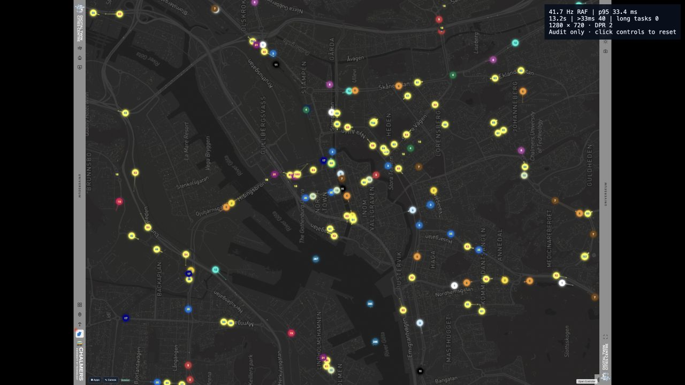

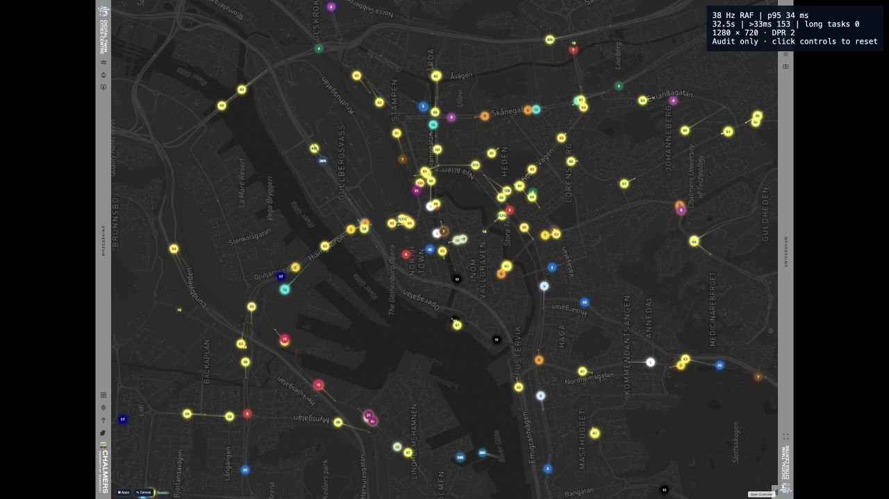

### 7. Slideshow — Buildings, Streets and Next work

Blue building footprints align with the map and remain visually crisp. Next successfully loaded Streets, with matching controller title and OpenStreetMap credit. The styling needs a stronger title/source caption and less competition from rotated street labels. Streets uses very fine lines that need on-site contrast testing. Automatic cycling was not tested in this run.

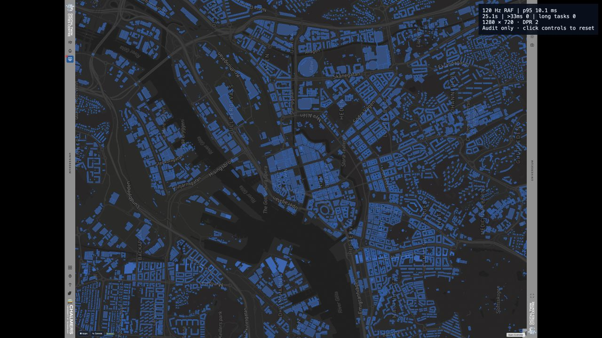

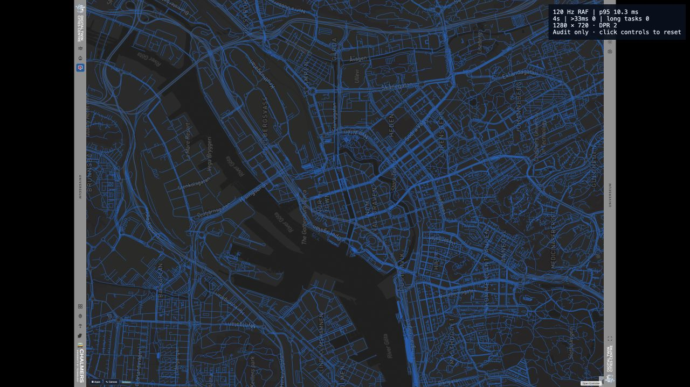

### 8. Table grid — working

The 8 × 6 square-cell layout is visible and the overlay automatically clears. Cyan nodes are attractive but grid lines are faint. For calibration, provide a steady, high-contrast hold mode with cell labels rather than relying only on a ten-second pulse. Physical alignment still requires on-site measurements.

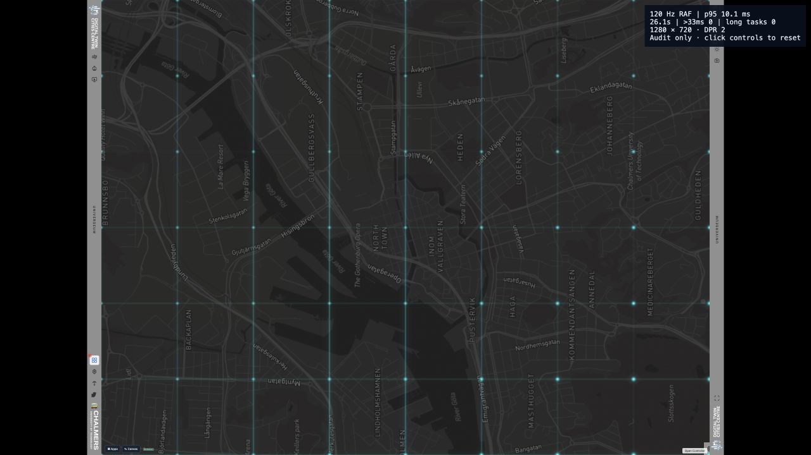

### 9. Canvas — drawing works; legibility weak

A test stroke rendered and Undo/Done were exercised. The line is fine and cyan-on-light-map contrast is weak; tools are too small to serve as projected visitor controls at this viewport. Other drawing tools, edit ownership and phone interaction were not exhaustively tested. No test annotation is intended to remain.

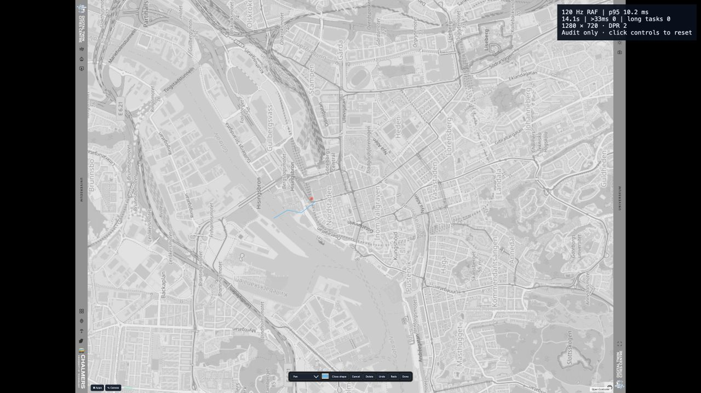

### 10. Controller and Street View — intermittent state failure; imagery works on retry

Screenshot shows Sun Study selected/enabled while Isovist controls and a placement placeholder remain visible. A fresh controller later opened Sun Study correctly. Street View's first placement did not yield a verified panorama; a later retry through the fresh controller successfully displayed street-level imagery with coordinates and heading. This verifies one location, not area-wide coverage or heading controls. Metadata still says “Active Layer: None” despite the active view. The UI displayed “SAM Server: Ready,” but segmentation was not executed and that label is not service-health evidence. The controller's “Connected” indicator is optimistic in source code rather than a verified heartbeat.

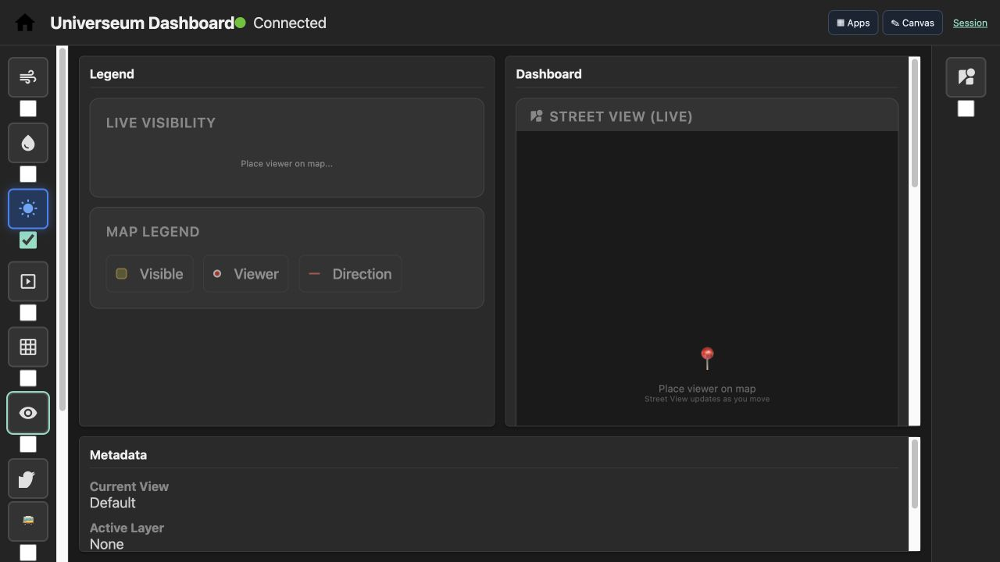

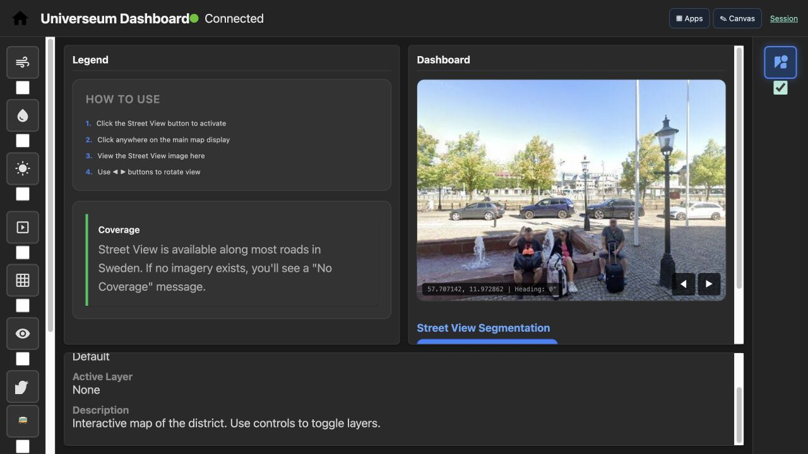

## Availability, checks and remaining acceptance work

Location validation passes with no asset errors. EPC is explicitly unavailable; Thermal Comfort, Campus Vision, FCC, ECOM and Cultural Gravity are disabled. Those are package exclusions, not passed visitor features. Street Glow is not a selectable Universeum layer.

Passed existing checks: table geometry/physical scaling, calibration handlers, georeferencing, CFD visual and solver tests, worker lifecycle tests, transit lifecycle/rate-limit handling, slideshow lifecycle/categories and six DEM-flow tests including JS/Python parity. The stormwater JS test initially required a fixture; rerunning through its intended Python test harness passed. These checks do not replace the failing browser interactions.

For acceptance on the installed VizLab computer, use the actual projector resolution, refresh rate and calibrated dimensions. Proposed target: stable 60 rendered FPS where the display supports 60 Hz, p95 frame intervals near 16.7 ms, no recurrent >50 ms stalls in steady scenes, immediate input feedback, and bounded memory/loop counts during an eight-hour soak with repeated layer changes. Record GPU/CPU, browser, resolution, DPR, frame times, dropped frames, long tasks and memory. Include animated Sun Study with trees/false colour, dense wind, stormwater, birds with repeated pan/zoom, transit outages, and allowed combinations. Hardware performance remains unverified until this run is done.

Visually, test from every intended side of the table under room lighting: readability of headings/legends, separation of layers from the physical model, QR scanning, icon target size and colour-independent interpretation. Keyboard and screen-reader access, reduced-motion behavior, phone sessions and acoustic quality need separate checks; this audit does not claim accessibility compliance.

Changes made for this audit are limited to the opt-in diagnostic loader/script and this report/evidence. Existing exhibit styling and simulation behavior were preserved so findings describe the supplied implementation.
