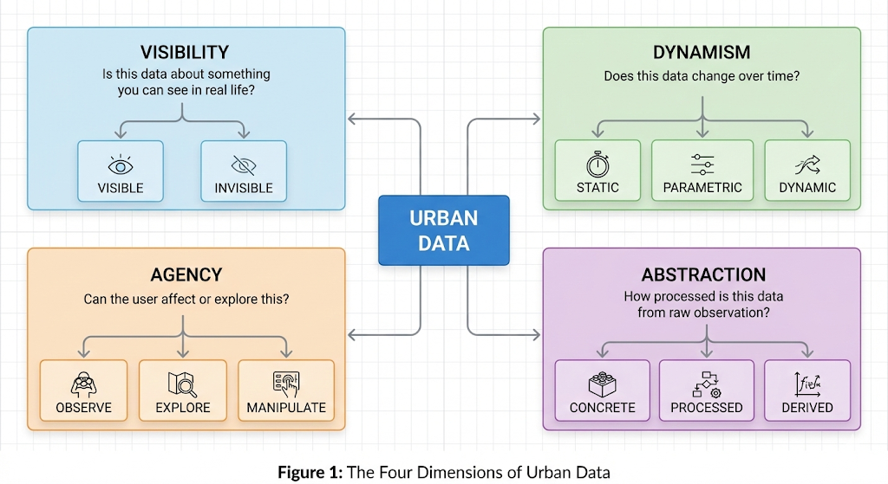
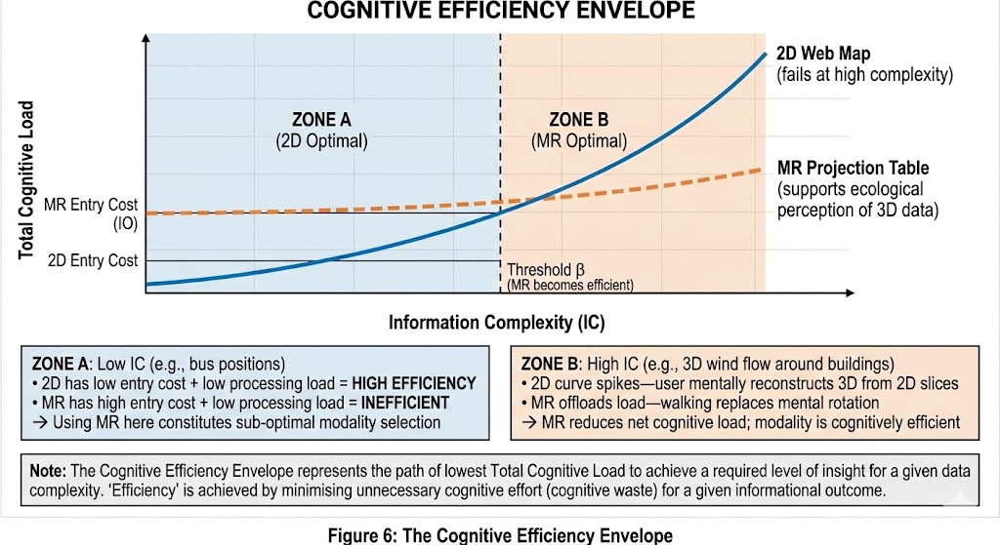
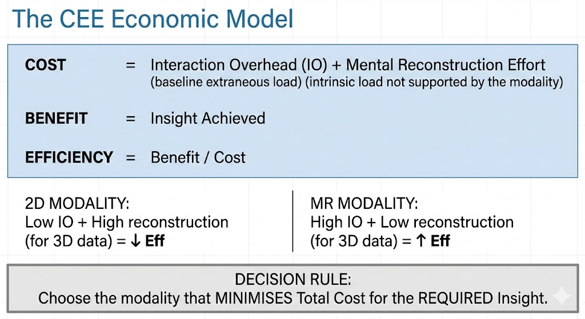
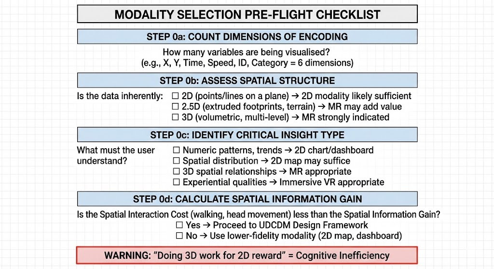
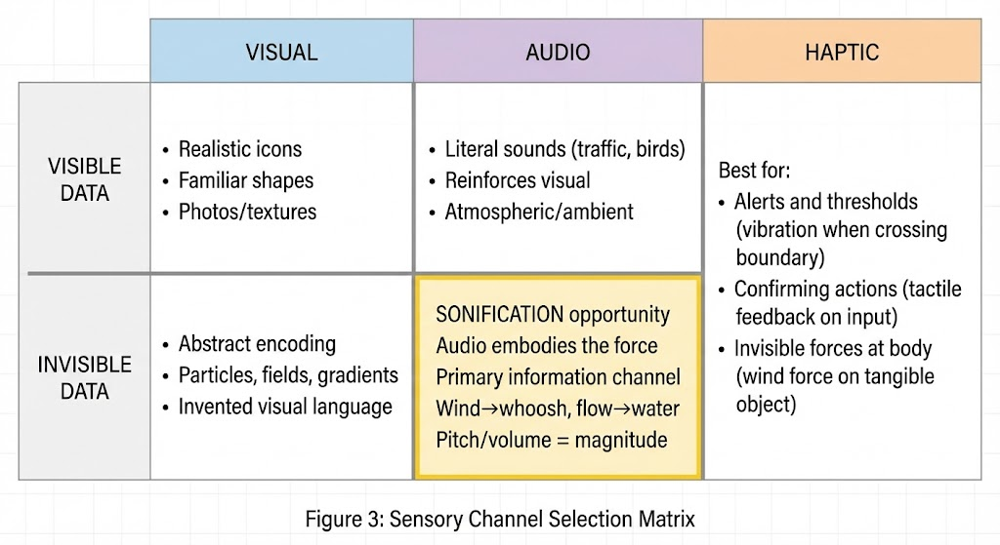
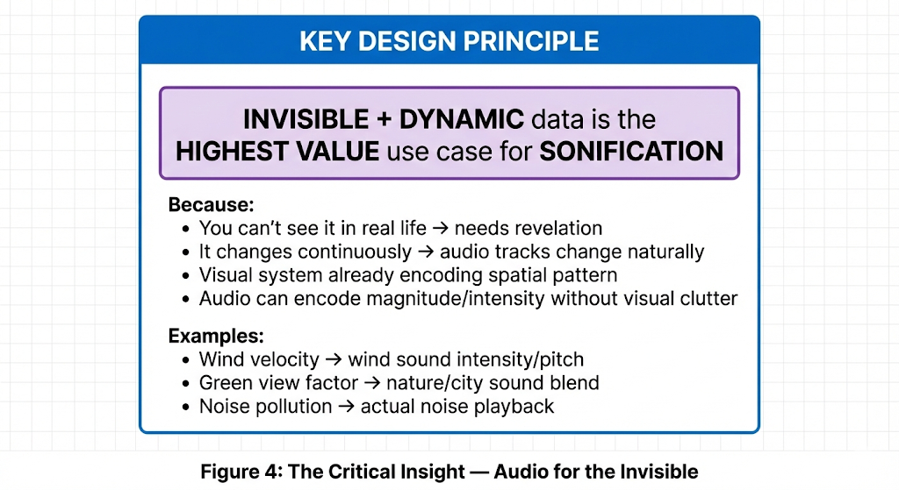
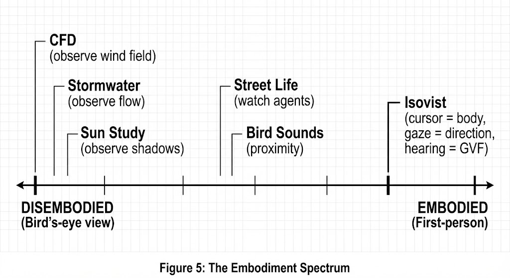
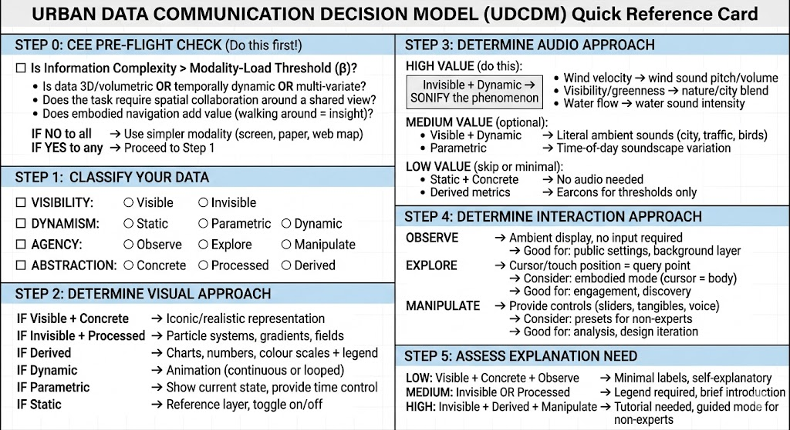

# A Framework for Multi-Sensory Information Design in Mixed Reality Urban Visualisation

**Version 3.0 — January 2026**

### Sanjay Somanath
---

## Abstract

Mixed reality (MR) projection tables offer compelling possibilities for urban data communication, yet the field lacks principled guidance for when such technologies are appropriate and how they should be designed. This paper addresses this gap with two contributions. First, we introduce the **Cognitive Efficiency Envelope (CEE)**, a decision framework that determines when MR is cognitively efficient compared to simpler 2D representations. The CEE operationalises Cognitive Load Theory for modality selection, identifying conditions under which deploying MR for low-complexity data constitutes cognitive inefficiency—what we term a "modality mismatch." Second, we present the **Urban Data Communication Decision Model (UDCDM)**, a four-dimension classification scheme (Visibility, Dynamism, Agency, Abstraction) that directly informs design decisions for visual encoding, sonification, and interaction. We argue that MR's primary value lies in revealing invisible, spatially complex, dynamic phenomena—and demonstrate through concrete examples how the framework prevents both underutilisation and misapplication of these technologies.

**Keywords** : mixed reality, urban visualisation, cognitive load theory, sonification, projection table, information design, embodied interaction, decision framework 

## 1. Introduction

### 1.1 The Problem: When High-Tech is the Wrong Choice

Consider the following scenario: a city planning department invests in a mixed reality projection table—a sophisticated system projecting dynamic visualisations onto a physical surface around which stakeholders can gather. For their first application, they display live public transport vehicle positions.

This seems reasonable. The technology is impressive, the data is real-time, and the physical table supports collaborative viewing. Yet from a cognitive efficiency perspective, this represents a failure of modality selection.

Apply a simple checklist to this use case:

- **Spatial structure**: The data is inherently 2D—vehicles exist at points on a planar road network. There is no meaningful vertical dimension.
- **Critical insight**: Users need to identify vehicle locations and delays—a pattern recognition task well-suited to 2D overview.
- **Spatial information gain**: Walking around the projection table provides *no additional insight* because the data has no 3D structure to explore.

The user is paying the **Interaction Overhead** of MR—physical movement, spatial orientation, learning new conventions—without receiving commensurate benefit. A standard 2D web map would deliver equivalent insight at lower cognitive cost. The projection table's capabilities are wasted on data that does not exploit them.

We term this a **modality mismatch**: deploying high-overhead technology for low-complexity data.

Contrast this with visualising computational fluid dynamics (CFD) wind flow around a proposed development. Here the data is volumetric (3D), invisible to the naked eye, and the critical insights concern how wind interacts with building geometry at different heights and orientations—relationships that benefit enormously from physical navigation around a spatial model. This is appropriate use of MR.

The problem is clear: urban visualisation practice lacks principled criteria for **modality selection**. Designers choose technologies based on novelty, availability, or stakeholder impressions rather than cognitive fit. The result is both underutilisation (failing to use MR for complex spatial data that would benefit) and misapplication (using MR for simple data that does not warrant the overhead).

### 1.2 Contribution

This paper provides two tools to address this problem:

1. **The Cognitive Efficiency Envelope (CEE)**: A pre-condition framework that determines *when* MR is cognitively efficient, based on the relationship between Information Complexity (IC) and Interaction Overhead (IO). The CEE identifies the Modality-Load Threshold—the complexity level above which MR becomes the efficient choice.

2. **The Urban Data Communication Decision Model (UDCDM)**: A four-dimension classification scheme that guides *how* to design within MR once the modality is justified. The dimensions—Visibility, Dynamism, Agency, and Abstraction—directly inform decisions about visual encoding, sonification, interaction design, and explanation requirements.

The framework is specifically designed for MR projection table applications but generalises to other spatial display modalities. Our central argument is that MR's primary value lies in **revealing invisible, spatially complex, dynamic phenomena**—and that using it for simpler data constitutes cognitive inefficiency.

---

**Figure 1: The Four Dimensions of Urban Data**

*Figure 1.* The four dimensions of urban data classification: (1) Visibility—is the phenomenon directly observable? (2) Dynamism—how does it change over time? (3) Agency—what can the user do? (4) Abstraction—how far removed from raw sensory data?

---

## 2. Theoretical Framing

In the following section, we state concisely the specific theoretical principles operationalised in this framework.

### 2.1 Cognitive Load and Modality Selection

Sweller's (1988) Cognitive Load Theory distinguishes **intrinsic load** (inherent to material complexity), **extraneous load** (imposed by presentation), and **germane load** (devoted to learning). Our framework operationalises this distinction for modality selection.

We define **Interaction Overhead (IO)** as the baseline extraneous cognitive load of a modality—the "entry cost" independent of data content. A 2D web map has low IO (look at screen). An MR projection table has higher IO (physical movement, spatial orientation, learning tangible conventions). Immersive VR has higher still (headset, motion management, loss of environmental awareness).

We define **Information Complexity (IC)** as the driver of intrinsic load for a dataset: its dimensionality, spatial structure (2D vs 3D), temporal dynamics, and variable interrelationships.

Each modality, therefore has a **complexity ceiling** beyond which it fails. When IC exceeds this ceiling on a lower modality, users struggle to mentally reconstruct what the display cannot represent leading to increased extraneous load. Stepping to a higher-fidelity modality, despite greater IO, can *reduce* total cognitive load by offloading reconstruction to perceptual systems.

This is the theoretical basis for the Cognitive Efficiency Envelope (Further elaborated in Section 3).

### 2.2 Embodied Exploration of Invisible Phenomena

Gibson's (1979) ecological approach positions perception as direct pickup of environmental information through exploratory action. We extend this to MR by framing the technology as a **prosthetic sense**—making invisible phenomena available for ecological exploration.

When a user walks around a projection table displaying wind flow data, they engage in genuine exploratory behaviour: head movements, viewing angle changes, ambulatory navigation. The mediation occurs at transduction (converting pressure differentials to visual particles), but exploration proceeds ecologically. MR thus restores ecological validity to data that would otherwise require purely symbolic interpretation.

This principle—that MR enables **embodied exploration of the invisible**—underlies our argument that invisible, spatially complex phenomena represent MR's highest-value application domain. For visible, 2D phenomena, MR adds cost without any additional perceptual benefit.

Sonification follows the same logic. Gaver's (1993) auditory icons leverage existing perceptual capacities for environmental sound. Wind flow represented as wind sound, water flow as water sound—these ecological mappings minimise learning demands. Sonification is most valuable for invisible, dynamic phenomena where audio does not compete with natural visual perception and can encode temporal dynamics that vision handles poorly.

---

## 3. The Cognitive Efficiency Envelope

**Figure 2: The Cognitive Efficiency Envelope**

*Figure 2.* The Cognitive Efficiency Envelope (CEE) illustrating the relationship between Information Complexity (IC) and Total Cognitive Load (TCL) across visualisation modalities. Zone A (low IC) represents the region where 2D modalities are cognitively efficient due to low entry cost. Zone B (high IC) represents the region where Mixed Reality becomes efficient as it offloads mental reconstruction effort. The Modality-Load Threshold marks the crossover point. The shaded region indicates cognitive inefficiency—a "modality mismatch"—where MR is deployed for data that does not warrant its Interaction Overhead.

**Zone A (Low IC):** 2D has low entry cost + low processing load = HIGH EFFICIENCY. MR has high entry cost for equivalent cognitive load = INEFFICIENT.

**Zone B (High IC):** 2D curve spikes as user mentally reconstructs 3D from 2D slices. MR offloads this load—walking replaces mental rotation. MR reduces net cognitive load; modality is cognitively efficient.

#### The CEE as Economic Model

The Cognitive Efficiency Envelope can be understood as a simple **cost-benefit calculation**:

**Figure 3: The CEE Economic Model**

*Figure 3.* The Cognitive Efficiency Envelope expressed as an economic model. Total Cost = Interaction Overhead (IO) + Mental Reconstruction Effort. Efficiency = Benefit / Cost. For low-complexity data, 2D modalities minimise total cost; for high-complexity 3D data, MR reduces reconstruction effort sufficiently to offset its higher IO.

| Data Type | 2D Modality Cost | MR Modality Cost | Efficient Choice |
|-----------|------------------|------------------|------------------|
| **Bus positions** (2D points) | Low IO + Zero reconstruction | High IO + Zero reconstruction | **2D** (lower total cost) |
| **Wind flow** (3D volumetric) | Low IO + High reconstruction | High IO + Low reconstruction | **MR** (lower total cost) |
| **Building shadows** (2.5D) | Low IO + Medium reconstruction | High IO + Low reconstruction | **Context-dependent** |

The economic intuition is simple: **pay the higher entry cost (IO) only when it buys you reduced reconstruction effort**. If the data is simple enough that 2D requires no mental reconstruction, paying MR's entry cost is wasteful—a modality mismatch.

### 3.2 The Modality-Load Threshold

The **Modality-Load Threshold** is the critical point where the Total Cognitive Load of a lower-fidelity modality exceeds the Interaction Overhead of a higher-fidelity modality. Below this threshold, the simpler modality is more cognitively efficient; above it, the more complex modality becomes appropriate despite its higher entry cost.

Several factors contribute to a dataset crossing the MR threshold:

**Spatial Dimensionality**: Data that is inherently three-dimensional (volumetric wind flow, building massing relationships, underground infrastructure) benefits from modalities that support natural 3D exploration. Data that is inherently two-dimensional (point locations, network paths on a plane) does not.

**Spatial Relationships**: Data where the critical insights emerge from understanding spatial relationships between elements (how does building A's shadow affect plaza B?) benefits from modalities that preserve and make navigable those relationships.

**Invisible Phenomena**: Invisible phenomena that vary spatially (wind speed differs on different sides of a building) benefit from modalities that allow physical exploration of that spatial variation.

**Multi-stakeholder Deliberation**: Situations requiring face-to-face discussion around shared spatial content benefit from modalities that support multiple simultaneous viewers with different viewpoints.

#### Table 1: Modality Selection Criteria

| Criterion | Favours 2D | Favours MR Projection | Favours Immersive VR |
|-----------|------------|----------------------|---------------------|
| **Spatial dimensionality** | Point/line data on plane | 2.5D (extruded) or 3D volumetric | Fully 3D, interior spaces |
| **Critical insight type** | Pattern recognition, comparison | Spatial relationships, navigation | Immersion, first-person experience |
| **Visibility of phenomena** | Visible, concrete | Invisible, requires revelation | Invisible, experiential |
| **Collaboration mode** | Individual analysis | Multi-stakeholder deliberation | Individual exploration |
| **Deployment context** | Office, remote access | Workshop, public engagement | Specialist review |
| **Interaction overhead tolerance** | Low (quick glance) | Medium (workshop session) | High (dedicated session) |

### 3.3 The modality selection Checklist

Before proceeding to the four-dimension design framework, apply the following **Modality Selection Checklist**:

**Figure 4: Modality Selection Checklist**

*Figure 4.* The Modality Selection Checklist. Before proceeding to the UDCDM design framework, practitioners should systematically assess: (a) dimensions of encoding, (b) spatial structure, (c) critical insight type, and (d) spatial information gain. A negative assessment indicates that a simpler modality (2D screen, paper map) may be more cognitively efficient.

---

## 4. The Four Dimensions of Urban Data

Having established that the data justifies the use of mixed reality (passing the CEE pre-condition), we now turn to the four dimensions that guide design decisions within that modality.

### 4.1 Dimension One: Visibility

The first dimension concerns the perceptual accessibility of the phenomenon: whether it can be directly observed or requires instrumentation to detect. Visible phenomena—buildings, vehicles, pedestrians, shadows—have natural visual representations available. Invisible phenomena—wind flow, noise levels, air quality, connectivity—must be given visual form through computational mediation. This distinction fundamentally shapes representation strategy: visible data can be depicted iconically, whilst invisible data requires the invention of a visual language.

#### Table 2: Visibility Classification Examples

| Value | Definition | Urban Examples | Design Implication |
|-------|------------|----------------|--------------------|
| **Visible** | Directly observable phenomena | Buildings, shadows, people walking, traffic, vegetation | Can use realistic/iconic representation; lower explanation need |
| **Invisible** | Forces/phenomena requiring instruments or inference | Wind flow, noise levels, air quality, sightlines, thermal comfort, connectivity | Must invent visual language; high value for sonification |

### 4.2 Dimension Two: Dynamism

The second dimension concerns the temporal behaviour of the data: whether it is essentially stable, whether it varies according to known parameters, or whether it exhibits continuous, emergent change. This dimension directly informs decisions about animation, interaction, and the role of sound.

Static data describes aspects of the urban environment that change only over extended timescales—years or decades. Building footprints, terrain, land use designations, and infrastructure networks fall into this category. Visualisations of static data serve primarily as reference or context, providing a stable frame within which more dynamic information can be understood. Animation is unnecessary and potentially misleading; the data should be presented as a stable backdrop that users can toggle on or off.

Parametric data varies according to known input parameters, most commonly time. Solar radiation and shadow patterns vary systematically with time of day and season; flood risk varies with rainfall intensity; thermal comfort varies with air temperature and humidity. Visualisations of parametric data benefit from interactive control—sliders, dials, or timeline scrubbers—that allow users to explore the parameter space and observe how the phenomenon changes. This is the domain of what-if analysis and scenario comparison, where the value lies in understanding how changing conditions affect outcomes.

Dynamic data exhibits continuous, emergent, or unpredictable change. Traffic flow, pedestrian movement, wind turbulence, and social activity fall into this category. These phenomena are characterised by complexity and emergence; patterns arise from the interactions of many individual agents or forces, and precise prediction is impossible. Visualisations of dynamic data require animation—the continuous updating of the display to reflect changing conditions—and this animation becomes a primary carrier of information. The rhythm, turbulence, and flow of the animation convey qualities that static images cannot capture.

The intersection of Visibility and Dynamism identifies the highest-value design space for sonification. Invisible and dynamic phenomena—wind flow, acoustic propagation, thermal convection—are doubly suited to auditory representation: they cannot be seen (so sound does not compete with vision) and they change continuously (so the temporal resolution of hearing can be exploited). The sound of wind, for example, is not merely an arbitrary sonification but an ecological acoustic phenomenon that carries real information about air movement.

#### Table 3: Dynamism Classification Examples

| Value | Definition | Urban Examples | Timescale | Design Implication |
|-------|------------|----------------|-----------|--------------------|
| **Static** | Fixed or changes over years | Building footprints, terrain, land use, infrastructure | Years-Decades | Reference layer; toggle on/off; no animation |
| **Parametric** | Changes based on known parameter | Shadows (time), flood risk (rainfall), thermal comfort (temperature) | Hours-Days | Time slider/dial control; before/after comparison |
| **Dynamic** | Continuously changing, emergent | Traffic flow, pedestrian movement, wind turbulence, social activity | Seconds-Minutes | Animation essential; particle systems; agent movement |

### 4.3 Dimension Three: Agency

The third dimension concerns the nature and extent of user control over the visualisation. This dimension directly informs interaction design, determining the input modalities, interface complexity, and learning requirements of the system.

Observation denotes a passive relationship in which the user watches the display without interacting. The visualisation runs autonomously, and the user's role is to attend, interpret, and understand. Observation is the appropriate mode for ambient displays, public installations, and situations where the goal is to communicate a predetermined message or create a particular atmosphere. Observation minimises learning requirements but also limits engagement and inquiry.

Exploration denotes an active relationship in which the user navigates through the information space, queries specific locations or objects, and reveals information through spatial movement. The critical characteristic of exploration is that the user controls what is revealed but not the underlying data or simulation. In projection table systems, exploration is often embodied: the cursor or touch point represents the user's position, and moving through the space reveals locally relevant information. This embodied exploration, as discussed in Section 2.1, aligns with theories of embodied cognition and may support deeper spatial understanding.

Manipulation denotes a generative relationship in which the user changes the parameters or configuration of the simulation and observes the effects. This is the domain of design iteration and impact assessment, where the value lies in testing alternatives and understanding consequences. Manipulation requires more complex interfaces—sliders, tangible objects, voice commands—and greater learning investment, but it supports the deepest engagement with the underlying systems being modelled.

The appropriate level of agency depends upon the audience and purpose of the visualisation. Public engagement may be best served by exploration, which supports inquiry and discovery without requiring expertise. Expert analysis may demand manipulation, allowing professionals to test hypotheses and refine designs. Ambient awareness may require only observation, where the goal is to create a persistent sense of urban conditions without demanding attention.

#### Table 4: Agency Classification Examples

| Value | Definition | User Role | Cognitive Load | Best Audience |
|-------|------------|-----------|----------------|---------------|
| **Observe** | Watch/view only; no interaction required | Spectator | Low | General public, ambient display |
| **Explore** | Navigate, query, reveal through movement | Explorer/Discoverer | Medium | Engaged public, professionals |
| **Manipulate** | Change parameters, test scenarios | Analyst/Designer | High | Experts, design professionals |

### 4.4 Dimension Four: Abstraction

The fourth dimension concerns the processing distance between raw observation and the displayed information. This dimension directly informs representation strategy and explanation requirements.

Concrete data represents physical entities in more or less direct correspondence: buildings, roads, trees, vehicles, people. The representation can be iconic—resembling what it depicts—and requires minimal explanation. A building shape represents a building; a tree symbol represents a tree. The cognitive work of interpretation is minimal because the mapping is familiar.

Processed data is computed from physical inputs but represents emergent or derived spatial patterns. Shadow projections, visibility polygons, flow paths, and particle traces fall into this category. The representation is typically metaphorical rather than iconic: particles do not literally exist in the wind, but they provide a useful visual metaphor for flow. Processing introduces interpretation: the designer has chosen to reveal certain patterns and not others, to use certain computational methods and parameters. Explanation is required—what does this represent? how was it computed?—but with appropriate guidance, users can develop intuitive understanding.

Derived data is synthesised from multiple inputs into indices, metrics, or scores. Green View Factor, walkability indices, comfort ratings, and accessibility scores fall into this category. These are abstractions of abstractions, multiple levels removed from direct observation. They necessarily involve value judgments about what to include and how to weight different factors. Representation is typically numerical or colour-coded, requiring legends and scales. Explanation requirements are high, and there is significant risk of misinterpretation or false precision.

The general principle is that higher abstraction requires more explanation, more careful design of legends and annotations, and greater attention to communicating uncertainty and limitations. Concrete data can largely speak for itself; derived data requires an accompanying narrative.

#### Table 5: Abstraction Classification Examples

| Value | Definition | Urban Examples | Explanation Need |
|-------|------------|----------------|------------------|
| **Concrete** | Direct representation of physical things | Building shapes, tree locations, road network, vehicle positions | Low — self-explanatory |
| **Processed** | Computed from physical data | Visibility polygon, shadow projection, flow paths, particle traces | Medium — requires legend and introduction |
| **Derived** | Metrics/indices synthesised from multiple sources | Green View Factor, walkability score, comfort index, accessibility rating | High — requires detailed explanation of methodology |

### 4.5 Summary: Dimension Values

The following table summarises the possible values for each dimension:

| Dimension | Values | Key Question |
|-----------|--------|---------------|
| **Visibility** | Visible, Invisible | Could you perceive this with your senses if you stood there? |
| **Dynamism** | Static, Parametric, Dynamic | Does this change, and at what timescale? |
| **Agency** | Observe, Explore, Manipulate | What can the user do with this? |
| **Abstraction** | Concrete, Processed, Derived | How far is this from raw sensory data? |

### 4.6 Interaction Paradigm Classification

The following table summarises the current interaction modes present across urban visualisation layers:

#### Table 6: Interaction Paradigm Classification

| Paradigm | Description | Example Layers | Engagement Type |
|----------|-------------|----------------|-----------------|
| **Passive Observation** | User watches without interacting | CFD, stormwater, street life, traffic | Ambient awareness |
| **Proximity/Spatial Trigger** | Content activated by user position | Bird sounds, slideshow | Serendipitous encounter |
| **Cursor-following (Embodied)** | Cursor position = simulated body | Isovist | Spatial cognition |
| **Parametric Control** | User adjusts parameters via sliders/dials | Sun study | Hypothesis testing |
| **Toggle/Mode Switching** | User activates/deactivates layers | All layers via buttons | Comparative viewing |

### 4.7 Sensory Distribution Analysis

An analysis of current layer implementations reveals an imbalance in sensory channel utilisation:

#### Table 7: Sensory Distribution Across Layers

| Sensory Channel | Layers Using | Coverage | Assessment |
|-----------------|--------------|----------|------------|
| **Visual** | CFD, Isovist, Sun Study, Street Life, Stormwater, Traffic, Grid, Street Glow, Slideshow | 9/10 | Comprehensive |
| **Auditory (Ambient)** | CFD (wind.mp3), Street Life (city.mp3) | 2/10 | Limited |
| **Auditory (Data-driven)** | Isovist (GVF → nature/city blend) | 1/10 | Pioneering but isolated |
| **Auditory (Spatial)** | Bird Sounds (proximity-triggered) | 1/10 | Limited |
| **Haptic** | None | 0/10 | Unexplored |

This analysis reveals that whilst visual encoding is comprehensive, auditory feedback is underutilised, and the sophisticated data-driven sonification pioneered in the isovist layer has not been generalised to other layers.

---

## 5. The Decision Framework

### 5.1 From Dimensions to Design Decisions

The four dimensions described above combine to define a space of possible data profiles, each with distinct implications for design. Rather than attempting to enumerate all possible combinations—which would produce an unwieldy taxonomy—the framework provides decision guidance organised around four key design questions: What visual approach is appropriate? What auditory approach is appropriate? What interaction approach is appropriate? And what level of explanation is required?

Each design question is addressed through conditional logic that examines the relevant dimensions. For visual approach, the key considerations are Visibility (which determines whether representation can be iconic or must be invented), Dynamism (which determines whether animation is needed), and Abstraction (which determines the complexity of the encoding). For auditory approach, the critical insight is that sonification is most valuable when data is both invisible and dynamic—a point developed further in Section 5.3. For interaction approach, the Agency dimension is primary, but Dynamism also plays a role: manipulating a static dataset produces a before/after comparison, whilst manipulating a dynamic simulation produces emergent, evolving results. For explanation requirements, Visibility and Abstraction are jointly determinative: invisible and derived data requires the most extensive explanation.

**Figure 5: The UDCDM Decision Tree**

*Figure 5.* The complete UDCDM decision tree incorporating the CEE gatekeeper (Step 0). The decision process begins by assessing whether Information Complexity exceeds the Modality-Load Threshold (β). If complexity is below this threshold, a simpler modality is recommended and the process terminates. If complexity exceeds the threshold, the designer proceeds through the four dimensions—Visibility, Dynamism, Agency, and Abstraction—each branch yielding specific design recommendations for visual encoding, sonification, interaction, and explanation strategy.

### 5.2 Visual Design Guidance

The visual encoding of urban data must balance several competing concerns: fidelity to the phenomenon, legibility of patterns, aesthetic coherence, and processing performance. The UDCDM framework provides guidance by relating visual strategy to the characterised dimensions.

For visible and concrete data, iconic representation is the natural choice. Buildings should look like buildings; trees should look like trees; vehicles should be recognisable as vehicles. The design challenge is stylisation—finding the appropriate level of detail and abstraction for the context—rather than invention. Animation should reflect real movement patterns: vehicles along roads, pedestrians along paths, shadows rotating with the sun.

For invisible data, the designer must invent a visual language. Several conventions have emerged: particles and streamlines for flow, gradients and heatmaps for fields, polygons for areas of influence or visibility. The design challenge is to create encodings that are learnable, memorable, and aesthetically integrated with the base representation. Careful attention to colour choice is essential: sequential colour scales for ordered data, diverging scales for data with a meaningful midpoint, and categorical palettes for nominal distinctions.

For dynamic data, animation becomes a primary information channel. The design challenge is to balance salience and subtlety: the animation must be noticeable enough to convey change but not so dominant that it distracts from other information layers. Frame rate, particle density, and motion blur can all be adjusted to control the visual weight of animated elements.

For derived data, the visual encoding must communicate uncertainty and origin. Legends, labels, and annotations become essential. The designer should consider whether a colour-coded heatmap is truly the best encoding, or whether the data might be better presented through an alternative representation such as a chart or numerical overlay.

### 5.3 Auditory Design Guidance

The use of sound in urban data visualisation represents perhaps the greatest opportunity for innovation and the greatest risk of failure. Poorly designed sonification can be annoying, confusing, or simply ignored; well-designed sonification can reveal temporal patterns and dynamic qualities that visual display cannot capture.

The UDCDM framework identifies invisible and dynamic data as the highest-value domain for sonification. The reasoning is twofold. First, invisible phenomena have no visual referent against which the sonification must compete or cohere; sound becomes the primary channel for aspects of the data that are not visually apparent, such as intensity or rate of change. Second, dynamic phenomena unfold in time, and hearing is exquisitely sensitive to temporal pattern; the ear can detect fluctuations and rhythms that the eye might miss.

Within this domain, the framework distinguishes two sonification strategies. Ecological sonification uses sounds that resemble the natural acoustic signature of the phenomenon: wind sounds for air flow, water sounds for stormwater runoff, traffic sounds for vehicle movement. This approach, aligned with Gaver's (1993) concept of auditory icons, leverages existing perceptual knowledge and minimises learning requirements. Parametric sonification uses arbitrary but systematic mappings from data values to audio parameters: pitch for velocity, volume for intensity, spatial panning for direction. This approach allows for more precise data representation but requires learning.

The framework recommends ecological sonification as the default approach for public-facing applications and parametric sonification for expert analytical applications. Hybrid approaches—ecological sounds with parametric modulation—offer a promising middle ground.

#### Table 8: Sonification Strategies

| Strategy | Description | Characteristics | Best For |
|----------|-------------|-----------------|----------|
| **Ambient** | Continuous background audio establishing atmosphere | Low cognitive demand; sets emotional tone; not data-mapped | Atmospheric/aesthetic layers |
| **Ecological** | Sounds resembling natural acoustic signature of phenomenon | Leverages existing perceptual knowledge; minimal learning | Public-facing applications |
| **Parametric** | Data values mapped to audio parameters (pitch, volume, tempo) | Precise data representation; requires learning | Expert analytical applications |
| **Spatial** | Audio positioned in 3D space relative to listener | Creates sense of presence; requires speaker array or binaural | Immersive exploration |
| **Event-based** | Discrete sounds triggered by data events | High attention capture; use sparingly | Alerts, state changes, thresholds |

#### Table 9: Audio-Visual Binding Strategies

| Data Property | Visual Encoding | Auditory Encoding | Binding Type |
|---------------|-----------------|-------------------|---------------|
| Wind velocity | Particle speed, colour | Pitch, volume | Complementary |
| Wind direction | Particle direction, arrows | Stereo panning | Redundant |
| Green View Factor | Colour tint on isovist | Nature/city sound blend | Complementary |
| Visibility distance | Polygon radius | Reverb amount | Complementary |
| Traffic density | Agent count, spacing | Urban hum volume | Redundant |
| Time of day | Shadow angle, lighting | Soundscape character | Complementary |
| Emergency event | Flashing lights | Siren sound | Redundant |

For visible and static data, sonification adds little value and may simply contribute to sensory clutter. Ambient audio may serve an atmospheric purpose, establishing mood or place identity, but it should be understood as aesthetic enhancement rather than information design.

**Figure 6: Sensory Channel Selection Matrix**

*Figure 6.* Sensory channel selection matrix. The optimal encoding strategy for each sensory channel depends on the Visibility dimension. Visible phenomena can leverage literal/iconic representations across all channels; invisible phenomena require invented visual languages but offer high-value opportunities for ecological sonification, where audio can embody the invisible force (e.g., wind sound for air flow).

**Figure 7: Using Audio for the Invisible**

*Figure 7.* For auditory design: the intersection of Invisible and Dynamic data represents the highest-value domain for sonification. Such phenomena cannot be seen (avoiding competition with vision), change continuously (exploiting the temporal resolution of hearing), and can often be represented through ecological sounds that leverage existing perceptual knowledge (e.g., wind velocity → wind sound intensity).

### 5.4 Interaction Design Guidance

The interaction design of a mixed reality projection table must accommodate diverse users, from expert analysts conducting detailed inquiries to community members encountering the system for the first time. The UDCDM framework provides guidance by relating interaction strategy to the Agency dimension.

For observation-level interactions, the system should function as an ambient display. Content plays automatically, perhaps cycling through different layers or scenarios. Controls should be minimal—perhaps a simple start/stop or layer toggle—to avoid intimidating casual users. The design emphasis should be on clarity and legibility rather than interactivity.

For exploration-level interactions, the system should support query and navigation. The fundamental gesture is pointing: touching or hovering over a location reveals information about that place. In embodied exploration mode—exemplified by the isovist visualisation—the cursor position represents the user's simulated body, and movement through the data space produces continuously updated feedback. This mode supports discovery and serendipity, allowing users to develop spatial intuition through exploration.

#### Table 10: Interaction Modalities for Projection Tables

| Modality | Description | Example Actions | Best For |
|----------|-------------|-----------------|----------|
| **Direct Touch** | Touch/gesture on table surface | Tap to query, drag to pan, pinch to zoom, draw to define area | Exploration, basic manipulation |
| **Tangible Objects** | Physical objects tracked on table | Building blocks as obstacles, viewer pawn for isovist, time dial | Design iteration, embodied manipulation |
| **Mid-air Gesture** | Above-table hand movements | Wave to dismiss, point to query, spread hands to zoom | Quick navigation, presentation mode |
| **Voice Command** | Spoken instructions | "Show wind", "Set time to 3pm", "Compare scenarios" | Hands-free control, accessibility |
| **Remote Device** | Secondary screen (tablet/phone) | Parameter sliders, detailed readouts, private view | Complex manipulation, facilitator control |

For manipulation-level interactions, the system should provide controls for adjusting parameters and testing scenarios. Tangible interaction—using physical objects on the table surface—offers a promising approach for manipulation, as it leverages spatial reasoning and supports collaborative discussion around a shared physical interface. Voice control offers hands-free manipulation for situations where users need to maintain visual attention on the display. Traditional graphical controls (sliders, buttons) can be relegated to a secondary device (tablet or phone) to avoid cluttering the projected display.

### 5.5 Explanation Strategy

Every visualisation encodes assumptions, simplifications, and interpretive choices that may not be apparent to viewers. The UDCDM framework addresses this through the concept of explanation level—a characterisation of how much contextual information and guidance users need to interpret the display correctly.

Low explanation requirements apply to data that is visible, concrete, and at the observe level. Such displays are largely self-explanatory: users can recognise what they see and understand what it represents without extensive guidance. A brief label or title may suffice.

Medium explanation requirements apply to data that is invisible or processed but follows learnable conventions. Users need to understand what is being represented (e.g., "this shows wind flow patterns") and how to interpret the encoding (e.g., "colour indicates wind speed"). A legend, brief introductory text, or guided tutorial can meet these needs.

High explanation requirements apply to data that is derived, highly abstract, or involves manipulation. Users need to understand not only what is represented but how it was computed, what assumptions were made, and what limitations apply. For derived metrics such as walkability scores or comfort indices, users should be informed of the underlying factors and their relative weights. For simulations, users should understand the boundary conditions and model assumptions. This level of explanation may require written documentation, guided tours, or expert facilitation.

### 5.6 Stakeholder Considerations

Different stakeholders bring different expertise, concerns, and interaction preferences to urban data visualisation. The framework can be applied to determine appropriate design choices for specific audiences.

#### Table 11: Stakeholder Profiles and Layer Relevance

| Stakeholder | Primary Concern | Preferred Agency | Relevant Layers | Design Considerations |
|-------------|-----------------|------------------|-----------------|----------------------|
| **Urban Planner** | Land use, density, connectivity | Manipulate | Isovist, sun study, street life, stormwater | Quantitative metrics; scenario comparison |
| **Architect** | Spatial quality, microclimate, form | Manipulate | Isovist, sun study, CFD wind | Direct manipulation; tangible objects |
| **Landscape Architect** | Green infrastructure, ecology | Explore | Isovist (GVF), bird sounds, stormwater | Ecological sonification; embodied exploration |
| **Transport Engineer** | Traffic flow, safety, capacity | Manipulate | Traffic, street life, isovist | Simulation control; parametric adjustment |
| **Community Member** | Quality of life, safety, aesthetics | Explore | Isovist, street life, bird sounds | Experiential understanding; guided tours |
| **Developer** | Site potential, views, value | Explore | Isovist, sun study, slideshow | Scenario comparison; report generation |
| **Accessibility Advocate** | Wayfinding, sensory accessibility | Explore | Isovist (auditory), street glow | Multi-sensory modes; voice control |

**Figure 8: The Embodiment Spectrum**

*Figure 8.* The Embodiment Spectrum. Different visualisation layers position users at different points along a continuum from disembodied observation (bird's-eye view, watching patterns) to embodied inhabitation (first-person perspective, cursor-as-body). Layers involving invisible phenomena and exploration-level agency tend toward higher embodiment. The isovist visualisation exemplifies maximum embodiment: cursor position → body position, cursor direction → gaze direction, audio feedback → simulated perception.

The isovist visualisation represents the most embodied interaction in the current system, where cursor position maps to body position, cursor direction maps to gaze direction, and the audio feedback (nature/city blend based on Green View Factor) provides a form of simulated perception.

---

## 6. Application and Critical Assessment

### 6.1 Framework Application

To illustrate the application of the UDCDM framework, consider the challenge of communicating wind flow patterns around a proposed building development to community stakeholders. Using the four dimensions:

The data is invisible: wind cannot be seen, only felt (and even then, only when sufficiently strong). This immediately signals that the visualisation must invent a visual language and has high potential value for sonification. The data is dynamic: wind flow is continuously changing, turbulent, and emergent from the interaction of air masses with built form. This reinforces the sonification opportunity and indicates that animation will be essential. The target agency is exploration: community stakeholders should be able to query different locations ("what would wind be like here?") but are not expected to modify the simulation parameters. This points toward embodied exploration with cursor-based query. The data is processed: it represents the output of computational fluid dynamics simulation, not direct measurement. This indicates medium explanation requirements—users need to understand that they are seeing a simulation with inherent uncertainties.

Synthesising these assessments, the framework recommends: an animated particle visualisation with colour-coded velocity; ecological sonification using wind sounds with parametric modulation (louder and higher-pitched in high-velocity zones); embodied exploration where cursor position produces locally relevant audio feedback; and introductory explanation of what CFD simulation is and what uncertainties apply, with ongoing guidance through labels and legends.

### 6.2 Critical Assessment of Existing Practice

The UDCDM framework enables critical assessment of existing urban visualisation practice. Two distinct failure modes can now be identified: **underutilisation** (failing to exploit the capabilities of multi-sensory display) and **modality mismatch** (deploying advanced modalities for data that does not warrant the Interaction Overhead).

**Underutilisation.** Much current practice underutilises the potential of multi-sensory display by defaulting to visual-only representations and observation-only interactions. Consider the widespread use of animated traffic simulations in transport planning. These typically show vehicles moving along roads—visible, concrete, dynamic data—with no audio channel. From the framework's perspective, this is a missed opportunity: traffic has a natural acoustic signature (engine noise, tyre sound, horns) that could reinforce the visual animation without requiring learning. However, the marginal value of sonification is lower here than for invisible phenomena because the visual representation is already quite successful.

More critically, many urban visualisations fail to reveal the most important invisible phenomena that shape urban experience. Wind comfort, acoustic environments, air quality, and thermal conditions are rarely visualised outside specialist technical applications, even though they profoundly affect the liveability and usability of urban spaces. The UDCDM framework highlights this gap and provides a vocabulary for articulating it: these are invisible, dynamic phenomena with high potential for multi-sensory revelation.

**Modality mismatch.** The converse error is equally problematic: deploying cognitively expensive modalities for low-complexity data. When complexity falls below the threshold, the Interaction Overhead of mixed reality—calibration, navigation, learning curves—exceeds the informational benefit. A common example is displaying static, two-dimensional tabular data on an interactive projection table: the cognitive effort required to physically navigate around the table, coordinate with other users, and interpret the projected interface provides no advantage over a simple screen or printed document. The economic principle of the Cognitive Efficiency Envelope provides a vocabulary for articulating this inefficiency: the Total Cognitive Load exceeds what simpler modalities would impose, with no corresponding gain in insight or engagement.

#### Table 12: Critical Assessment of Current Practice

| Layer | Current Strength | Current Gap | Recommendation |
|-------|------------------|-------------|----------------|
| **CFD Wind** | Physics-based simulation; particle visualisation | Audio not data-mapped; observe-only | Sonify velocity at cursor position; add tangible obstacles |
| **Isovist** | Best multi-sensory integration; embodied exploration | Limited derived metrics display | Compute and display all isovist metrics in real-time |
| **Sun Study** | Intuitive parametric control; realistic shadows | No audio feedback | Consider time-of-day soundscape variation |
| **Street Life** | Engaging animation; rich visual detail | Audio not position-aware | Map city sounds to local agent density |
| **Stormwater** | Good flow visualisation | No audio channel | Add water/rain sounds mapped to flow intensity |
| **Traffic** | Clear path-following animation | Generic; no agency | Allow route manipulation; query travel times |

### 6.3 Limitations and Future Development

The UDCDM framework has several limitations that should be acknowledged. First, the four dimensions, whilst parsimonious, do not capture all relevant considerations. The framework does not directly address questions of scale (building, neighbourhood, city), data uncertainty, or aesthetic qualities, all of which are important in practice.

Second, the framework provides guidance but not deterministic prescriptions. Designers must still exercise judgment in applying the framework to specific contexts, audiences, and purposes. The decision tree structure may create an illusion of algorithmic certainty that is not warranted.

Third, the empirical basis for the framework's recommendations is incomplete. Whilst we have grounded the framework in relevant theory, the specific claims about sonification value and embodied exploration effectiveness require further experimental validation.

Future development of the framework should address these limitations through empirical research, particularly controlled studies comparing different design approaches across the dimensions, and through iterative refinement based on practical application.

---

## 7. Conclusion

The Urban Data Communication Decision Model offers a structured approach to navigating the complex design space of mixed reality urban visualisation. By characterising data along four fundamental dimensions—Visibility, Dynamism, Agency, and Abstraction—the framework provides a vocabulary for discussing design choices and a logic for deriving recommendations.

The central argument of this work is that the highest value of multi-sensory urban display lies in revealing invisible, dynamic phenomena through complementary visual and auditory encoding. Wind flow, acoustic environments, thermal conditions, and visual access are among the most important factors shaping urban experience, yet they remain largely imperceptible without technological mediation. Mixed reality projection tables, with their capacity for spatial correspondence, animation, and spatial audio, are ideally suited to this task of perceptual revelation.

The framework is offered not as a rigid prescription but as a thinking tool—a structured way of asking questions about data characteristics and their design implications. Used critically and reflexively, it can support more thoughtful and effective urban data communication.

---

## References

Bertin, J. (1967) *Sémiologie graphique: Les diagrammes, les réseaux, les cartes*. Paris: Gauthier-Villars. [English translation: *Semiology of Graphics*, 1983, University of Wisconsin Press].

Bregman, A.S. (1990) *Auditory Scene Analysis: The Perceptual Organization of Sound*. Cambridge, MA: MIT Press.

Cleveland, W.S. and McGill, R. (1984) 'Graphical perception: Theory, experimentation, and application to the development of graphical methods', *Journal of the American Statistical Association*, 79(387), pp. 531–554.

Corner, J. (1999) 'The agency of mapping: Speculation, critique and invention', in Cosgrove, D. (ed.) *Mappings*. London: Reaktion Books, pp. 213–252.

Dourish, P. (2001) *Where the Action Is: The Foundations of Embodied Interaction*. Cambridge, MA: MIT Press.

Gaver, W.W. (1991) 'Technology affordances', in *Proceedings of the SIGCHI Conference on Human Factors in Computing Systems*. New York: ACM, pp. 79–84.

Gaver, W.W. (1993) 'What in the world do we hear? An ecological approach to auditory event perception', *Ecological Psychology*, 5(1), pp. 1–29.

Gibson, J.J. (1966) *The Senses Considered as Perceptual Systems*. Boston: Houghton Mifflin.

Gibson, J.J. (1979) *The Ecological Approach to Visual Perception*. Boston: Houghton Mifflin.

Heidegger, M. (1977) *The Question Concerning Technology and Other Essays*. Translated by W. Lovitt. New York: Harper & Row.

Hermann, T., Hunt, A. and Neuhoff, J.G. (eds.) (2011) *The Sonification Handbook*. Berlin: Logos Verlag.

Ihde, D. (1990) *Technology and the Lifeworld: From Garden to Earth*. Bloomington: Indiana University Press.

Kramer, G. (ed.) (1994) *Auditory Display: Sonification, Audification, and Auditory Interfaces*. Reading, MA: Addison-Wesley.

Lakoff, G. and Johnson, M. (1999) *Philosophy in the Flesh: The Embodied Mind and Its Challenge to Western Thought*. New York: Basic Books.

Mackinlay, J. (1986) 'Automating the design of graphical presentations of relational information', *ACM Transactions on Graphics*, 5(2), pp. 110–141.

Matthews, T., Dey, A.K., Mankoff, J., Carter, S. and Rattenbury, T. (2007) 'A toolkit for managing user attention in peripheral displays', in *Proceedings of the 20th Annual ACM Symposium on User Interface Software and Technology*. New York: ACM, pp. 247–256.

Munzner, T. (2014) *Visualization Analysis and Design*. Boca Raton, FL: CRC Press.

Shneiderman, B. (1996) 'The eyes have it: A task by data type taxonomy for information visualizations', in *Proceedings of the IEEE Symposium on Visual Languages*. Los Alamitos, CA: IEEE Computer Society Press, pp. 336–343.

Spence, C. (2011) 'Crossmodal correspondences: A tutorial review', *Attention, Perception, & Psychophysics*, 73(4), pp. 971–995.

Sweller, J. (1988) 'Cognitive load during problem solving: Effects on learning', *Cognitive Science*, 12(2), pp. 257–285.

Varela, F.J., Thompson, E. and Rosch, E. (1991) *The Embodied Mind: Cognitive Science and Human Experience*. Cambridge, MA: MIT Press.

Vickers, P. (2016) 'Sonification and music, music and sonification', in Hermann, T., Hunt, A. and Neuhoff, J.G. (eds.) *The Sonification Handbook*. Berlin: Logos Verlag, pp. 455–472.

Walker, B.N. and Kramer, G. (2004) 'Ecological psychoacoustics and auditory displays: Hearing, grouping, and meaning making', in Neuhoff, J.G. (ed.) *Ecological Psychoacoustics*. Amsterdam: Elsevier, pp. 150–175.

Weiser, M. (1991) 'The computer for the 21st century', *Scientific American*, 265(3), pp. 94–104.

---

## Appendix A: Design Recipes for Common Data Profiles

The following table provides ready-to-use design recommendations for common combinations of the four dimensions:

### Recipe 1: INVISIBLE + DYNAMIC + OBSERVE (e.g., CFD Wind Simulation)

| Design Aspect | Recommendation |
|---------------|----------------|
| **Visual** | Particle system or vector field; colour-coded by magnitude |
| **Audio** | SONIFICATION (high value): velocity → pitch + volume |
| **Interaction** | Passive observation with cursor query for local values |
| **Explanation** | Medium: introduce what CFD simulation is; provide legend |

### Recipe 2: INVISIBLE + DYNAMIC + EXPLORE (e.g., Isovist Visibility)

| Design Aspect | Recommendation |
|---------------|----------------|
| **Visual** | Computed polygon with gradient bands; path trace |
| **Audio** | SONIFICATION (high value): derived metric → audio parameter (e.g., GVF → nature/city blend) |
| **Interaction** | Embodied: cursor = body position, direction = gaze |
| **Explanation** | Medium: brief introduction to visibility analysis |

### Recipe 3: VISIBLE + PARAMETRIC + MANIPULATE (e.g., Sun Study)

| Design Aspect | Recommendation |
|---------------|----------------|
| **Visual** | Realistic shadow projection; direct representation |
| **Audio** | Optional: time-of-day soundscape variation |
| **Interaction** | Time slider/dial control; date selection |
| **Explanation** | Low: intuitive and self-explanatory |

### Recipe 4: VISIBLE + DYNAMIC + OBSERVE (e.g., Street Life)

| Design Aspect | Recommendation |
|---------------|----------------|
| **Visual** | Animated agents with iconic representation; motion = flow |
| **Audio** | Literal ambient: city sounds matching visual activity |
| **Interaction** | Passive observation; optional click-to-query |
| **Explanation** | Low: self-explanatory animation |

### Recipe 5: INVISIBLE + DYNAMIC + MANIPULATE (e.g., Scenario-based CFD)

| Design Aspect | Recommendation |
|---------------|----------------|
| **Visual** | Particle system with real-time update; side-by-side comparison |
| **Audio** | Parameter-mapped sonification for expert users |
| **Interaction** | Tangible objects (building blocks); parameter sliders |
| **Explanation** | Medium-High: explain simulation assumptions and limitations |

---

## Appendix B: Quick Reference Decision Matrix

| Profile | Visual Approach | Audio Approach | Interaction | Explanation |
|---------|-----------------|----------------|-------------|-------------|
| Visible + Static + Observe | Iconic, stable | None/ambient | Toggle | Low |
| Visible + Dynamic + Observe | Iconic, animated | Literal ambient | Toggle | Low |
| Visible + Parametric + Manipulate | Iconic, state-based | Optional ambient | Slider/dial | Low-Medium |
| Invisible + Dynamic + Observe | Invented, animated | Ecological sonification | Toggle | Medium |
| Invisible + Dynamic + Explore | Invented, responsive | Parametric sonification | Embodied cursor | Medium |
| Invisible + Parametric + Manipulate | Invented, state-based | Parameter-mapped | Controls + query | Medium-High |
| Derived + Any + Any | Abstract, annotated | Threshold alerts | Depends on agency | High |

---

## Appendix C: Single-Page Quick Reference Card

**Figure 9: UDCDM Quick Reference Card**

*Figure 9.* Single-page quick reference card summarising the complete UDCDM framework. The card provides: (1) the CEE pre-flight checklist for modality selection, (2) the four-dimension classification scheme, (3) design guidance for visual, auditory, and interaction approaches, and (4) decision rules linking dimension values to recommended strategies. Intended for use as a practical desk reference during design sessions.

---

## Appendix D: Layer Classification Example

The following table demonstrates how the framework can be applied to classify existing visualisation layers:

| Layer | Visibility | Dynamism | Agency | Abstraction |
|-------|------------|----------|--------|-------------|
| CFD Wind Simulation | Invisible | Dynamic | Observe | Processed |
| Isovist Visibility | Invisible | Dynamic | Explore | Processed |
| Sun Study | Visible | Parametric | Manipulate | Concrete |
| Street Life Animation | Visible | Dynamic | Observe | Concrete |
| Stormwater Flow | Invisible | Dynamic | Observe | Processed |
| Bird Sounds | Visible* | Static | Explore | Concrete |
| Traffic Simulation | Visible | Dynamic | Observe | Concrete |
| Historical Slideshow | Visible | Static | Explore | Concrete |

*Note: Birds are visible, but the soundscape is typically unnoticed—arguably invisible.

---

## Appendix E: Summary of All Tables

The following tables are included in this document:

| Table | Title | Section | Purpose |
|-------|-------|---------|--------|
| 1 | Visibility Classification Examples | 4.1 | Define visible vs invisible phenomena |
| 2 | Dynamism Classification Examples | 4.2 | Define static, parametric, and dynamic data |
| 3 | Agency Classification Examples | 4.3 | Define observe, explore, and manipulate modes |
| 4 | Abstraction Classification Examples | 4.4 | Define concrete, processed, and derived data |
| 5 | Interaction Paradigm Classification | 4.6 | Categorise interaction modes |
| 6 | Sensory Distribution Across Layers | 4.7 | Audit current sensory channel usage |
| 7 | Interaction Modalities for Projection Tables | 5.4 | Guide input modality selection |
| 8 | Stakeholder Profiles and Layer Relevance | 5.6 | Match layers to audience needs |
| 9 | Critical Assessment of Current Practice | 6.2 | Identify gaps and opportunities |
| 10 | Sonification Strategies | 5.3 | Guide audio design approach |
| 11 | Audio-Visual Binding Strategies | 5.3 | Coordinate multi-sensory encoding |
| 12 | Modality Selection Criteria | 3.2 | Determine appropriate display technology |
| 13 | CEE Economic Model Decision Matrix | 3.1 | At-a-glance modality cost comparison |

## Appendix F: Glossary of Terms

**Abstraction**: The processing distance between raw observation and displayed information, ranging from concrete (direct representation) through processed (computed from inputs) to derived (synthesised metrics).

**Agency**: The nature and extent of user control, ranging from observe (passive viewing) through explore (query and navigation) to manipulate (parameter adjustment).

**Cognitive Efficiency Envelope (CEE)**: The relationship between Information Complexity and Total Cognitive Load across different display modalities, used to determine when mixed reality is cognitively efficient versus when simpler technologies suffice. Visualised as a plot where each modality has a characteristic curve representing the path of lowest cognitive effort to achieve required insight.

**Dynamism**: The temporal behaviour of data, ranging from static (stable) through parametric (varying with known inputs) to dynamic (continuously changing).

**Ecological sonification**: Sonification using sounds that resemble the natural acoustic signature of the phenomenon being represented.

**Embodied exploration**: An interaction mode in which the user's cursor or touch position represents their simulated body position in the data space.

**Extraneous Cognitive Load**: In Cognitive Load Theory (Sweller, 1988), the cognitive burden imposed by the manner of presentation rather than the content itself. In the UDCDM framework, Interaction Overhead (IO) constitutes the baseline extraneous load inherent to a given modality.

**Information Complexity (IC)**: A composite measure of data characteristics—including spatial dimensionality (2D/3D), temporal dynamics (static/dynamic), and multivariate relationships—that determines the intrinsic cognitive demands of a visualisation task. IC is the primary driver of intrinsic cognitive load for urban datasets.

**Interaction Overhead (IO)**: The baseline extraneous cognitive load imposed by a modality's interface, independent of the specific data payload. Includes learning curves, physical navigation requirements, calibration, and coordination with other users. IO varies by modality: paper has near-zero IO, whilst mixed reality projection tables impose significant IO. Poorly designed interaction for complex data can add additional extraneous load beyond this baseline.

**Intrinsic Cognitive Load**: In Cognitive Load Theory (Sweller, 1988), the cognitive burden inherent to the complexity of the material being learned or understood. In the UDCDM framework, Information Complexity (IC) is the primary driver of intrinsic load for urban data visualisation tasks.

**Mixed reality projection table**: A display system that projects dynamic visual information onto physical surfaces, enabling spatial correspondence, social interaction, and multi-sensory output.

**Modality-Load Threshold**: The Information Complexity value at which the Total Cognitive Load curves of two modalities intersect. Above this threshold, the higher-fidelity modality becomes cognitively efficient; below it, simpler alternatives impose lower total cognitive load.

**Parametric sonification**: Sonification using arbitrary but systematic mappings from data values to audio parameters.

**Revelation**: The design goal of making perceptible phenomena that are normally invisible to unaided human senses.

**Total Cognitive Load (TCL)**: The sum of intrinsic load (inherent to the data), extraneous load (imposed by interface and presentation), and germane load (devoted to productive schema construction), as defined by Cognitive Load Theory (Sweller, 1988). In the UDCDM framework, TCL ≈ f(IC) + IO, where f(IC) represents intrinsic load driven by data complexity and IO represents baseline extraneous load from the modality.

**Visibility**: Whether the data represents something that could be directly perceived by a human observer in the urban environment (visible) or requires instruments or inference (invisible).

**Modality mismatch**: An error in modality selection where advanced display technology (e.g., mixed reality) is deployed for data with Information Complexity below the Modality-Load Threshold, resulting in unnecessary Interaction Overhead and cognitive inefficiency.

---

*Document prepared for the ACE MR Table Research Project.*
